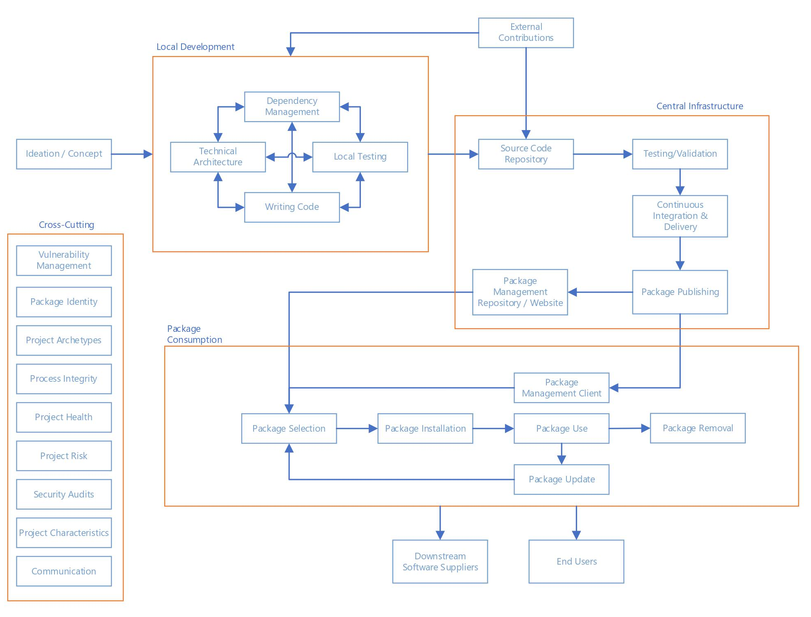
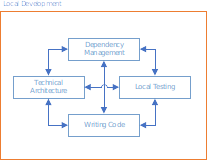
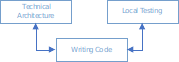
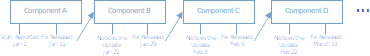
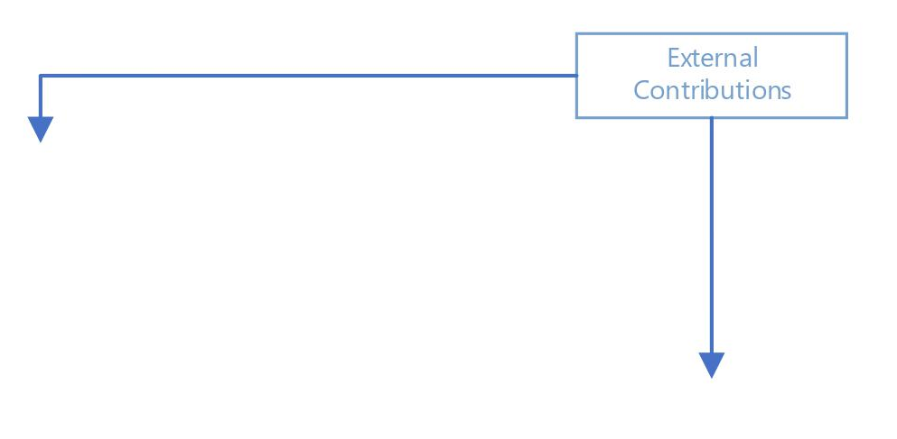
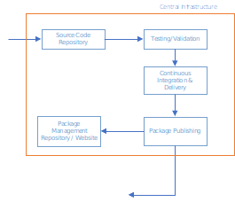
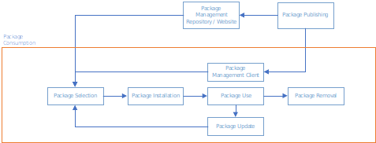

## Threats, Risks, and Mitigations in the Open Source Ecosystem

*[Michael Scovetta](mailto:michael.scovetta@microsoft.com), Microsoft*

*in collaboration with the Open Source Security Coalition*

The purpose of this document is to build a mutual understanding of the high-level threats, security risks, and potential mitigations associated with the open source ecosystem. There is a natural overlap between these threats and risks, and those that affect the more general software development process. The primary intended audience consists of members of the [Open Source Security Coalition](https://securitylab.github.com/) (the “Coalition”, herein) and similar organizations interested in promoting and advancing improvements to the security of the open source ecosystem, but should not be considered as a product roadmap or promised set of features. It should also be noted that this document focuses exclusively on security risk and does not include risks related to intellectual property (i.e. patents, copyright, licensing, contracts).

# Introduction

Open source software is an essential part of modern software development, and of practically all technology solutions. Adoption of open source software has grown over the past two decades, powering everything from tiny Internet of Things devices to the most advanced supercomputers in the world. Over the last decade, the quantity of open source available through package management systems has grown from around 30,000 to well over two million today. This has led to enormous productivity gains, allowing software engineers to focus more on solving business problems and less on creating and re-creating the same building blocks needed in many situations.

Open source itself, however, is primarily created by volunteers, working on their own time on a project they are passionate about. They often receive no monetary compensation for their work other than satisfaction that their creation is useful to others, but their work product is routinely used to power for-profit businesses and other organizations. This can create discord between the producers and consumers.

> *"Open Source & I are going through a labor dispute right now. I really lost a lot of faith in open source when I noticed billion dollar corporations were using my software and not a single one ever bothered to donate even a few dollars to keep it going, but filed tickets." - Jordon Bedwell (@envygeeks)*

Open source software brings great capability, but with it comes some amount of risk. According to the [2019 State of Software Supply Chain](https://www.sonatype.com/en-us/software-supply-chain-2019) report released by Sonatype:

- The number of days between vulnerability disclosure and exploit creation has shrunk from 45 to 3.

- Over half of JavaScript components contain at least one known security vulnerability.

- JavaScript packages are downloaded over 10 billion times per week (via NPM), which averages to more than 53,000 per developer per year.

More generally, security vulnerabilities continue to grow in number, with over 17,000 CVEs¹ published in 2019 and nearly 9,000 published in the first half of 2020. Of those 26,000, over 4,000, or fifteen percent, were rated [critical](https://nvd.nist.gov/vuln-metrics/cvss).

These are scary numbers, but they do not tell the whole story. The purpose of this document is not to promote fear, but to offer solutions and align disparate efforts toward a common goal. To move forward, we must first build a mutual understanding of the threats and risks associated with the open source ecosystem. Where applicable, we offer suggestions on ways to address the threats and mitigate the risks, but we do not presume any of this to be exhaustive. At best, we hope to start a conversation about the best way to proceed.

A summary of recommendations can be found in the [Appendix]().

## Version History

|     |                                   |           |
|:---:|:--------------------------------- |:---------:|
| 0.1 | Initial draft                     | 4/16/2020 |
| 0.2 | Final draft                       | 5/5/2020  |
| 1.0 | Initial release                   | 5/13/2020 |
| 1.1 | Updates based on initial feedback | 6/16/2020 |

---

¹ CVEs cover both open source and proprietary software.

---

## Related Work

The following resources contain content that supplements the information to this document.

### Industry Reports

- [The State of Open Source Security Vulnerabilities](https://www.whitesourcesoftware.com/open-source-vulnerability-management-report/) (2020, WhiteSource)

- [The State of Open Source Security ](https://snyk.io/opensourcesecurity-2019/)(2019, Snyk)

- [Open Source Security and Risk Analysis (OSSRA)](https://www.synopsys.com/software-integrity/resources/analyst-reports/2019-open-source-security-risk-analysis.html) (2019, Synopsys)

- [2019 Software Supply Chain Report](https://www.sonatype.com/en-us/software-supply-chain-2019) (2019, Sonatype)

### Guidelines, White Papers, and Standards

- [Fundamental Practices for Secure Software Development](https://safecode.org/wp-content/uploads/2018/03/SAFECode_Fundamental_Practices_for_Secure_Software_Development_March_2018.pdf) (SAFECode)

- [Managing Security Risks Inherent in the Use of Third-party Components](https://safecode.org/wp-content/uploads/2017/05/SAFECode_TPC_Whitepaper.pdf) (SAFECode)

- [Microsoft Security Development Lifecycle](https://www.microsoft.com/en-us/securityengineering/sdl/)

- [NIST SP 800-160](https://nvlpubs.nist.gov/nistpubs/SpecialPublications/NIST.SP.800-160v1.pdf) (Systems Security Engineering)

- [NIST SP 800-37](https://nvlpubs.nist.gov/nistpubs/SpecialPublications/NIST.SP.800-37r2.pdf) (Risk Management Framework for Information Systems and Organizations)

- [OWASP Packman](https://github.com/OWASP/packman) (Documentation/tracking of security controls of popular package management systems)

- [OWASP Software Component Verification Standard](https://owasp.org/www-project-software-component-verification-standard/)

## Acknowledgments

Thank you to everyone who reviewed, commented, and provided content for this document; most especially to Guy Acosta, Bas Alberts, Chris Aniszczyk, Charles Brenner, Jennifer Fernick, John Gossman, Luigi Gubello, Chris Jeuell, Maya Kaczorowski, Radoslaw Karpowicz, Steve Lipner, Jason Keirstead, Dan Lorenc, Elie Saad, Andrew Trompler, and Kay Williams.

## Table of Contents

|                                                               |     |
| ------------------------------------------------------------- | ---:|
| [Introduction](#Introduction)                                 | 1   |
| [Threats & Risks](#Threats-&-Risks)                           | 5   |
| [Ideation / Concept Phase](#Ideation-/-Concept-Phase)         | 5   |
| [Local Development Phase](#Local-Development-Phase)           | 8   |
| [External Contributions Phase](#External-Contributions-Phase) | 17  |
| [Central Infrastructure Phase](#Central-Infrastructure-Phase) | 19  |
| [Package Consumption Phase](#Package-Consumption-Phase)       | 23  |
| Vulnerability Reporting & Security Response Phase             | 34  |
| Cross-Cutting Activities                                      | 38  |
| Conclusion                                                    | 47  |
| Appendix                                                      | 48  |

# Threats & Risks

To better frame what we’re going to be exploring, we’ll start with a simple diagram that describes the major parts of the open source ecosystem and how they often relate to one another.

We will use the diagram above to frame our exploration of threats and possible mitigations, after which we’ll discuss some general, cross-cutting practices and recommendations.

## Ideation / Concept Phase

In this phase, there are few explicit threat actors; instead, there is the potential for “business”-level security flaws, biases that have security implications, and other high-level design problems that can have severe consequences if not identified and properly addressed.

These risks can be influenced by various aspects of a system:

- **Attack Surface.** As a system’s attack surface grows or becomes less well-defined, it becomes more susceptible to attack. For example, systems that attackers have physical possession of are often harder to secure against tampering or introspection. Systems that have many dependencies could be attacked using a defect in any of them. 

- **Technology Stack Risks.** Certain technologies are inherently more susceptible to attack than others; for example, most modern programming languages have been built to avoid the memory safety challenges that have [affected](https://www.zdnet.com/article/microsoft-70-percent-of-all-security-bugs-are-memory-safety-issues/) C and other “low-level” languages.

- **Security-Sensitive Functionality.** From a security perspective, certain tasks are simply more important than others. For example, it is more important that a library that performs authentication or authorization do so correctly than it is that a calendar widget properly account for leap years. Operating system kernels, cryptographic libraries, and cloud orchestration systems also fall into this category, as do many other components that depend on the context of the system they are being used with.

- **Unproven Technology.** New technologies often offer advantages, but practically no one “gets it right” on their first try. Whether it’s a new platform, programming language, framework, or library, placing too much reliance on the security of that new technology can be a mistake until it’s been proven out.

In addition, it’s important to realize that not all risks are technical in nature; systems that perform any of the following are more likely to be attacked than others:

- Systems that transfer money or other assets between accounts.

- Systems that provide assurance that certain events have taken place.

- Systems that protect access to highly valuable assets.

- Systems that claim to provide anonymity or pseudonymity.

To mitigate these risks, security practitioners often recommend [threat modeling](https://safecode.org/wp-content/uploads/2017/05/SAFECode_TM_Whitepaper.pdf) and a security-oriented design review (also known as an architectural risk analysis). There are many approaches to performing these, and though they are often as much “art” as “science,” there are some excellent examples that are publicly available:

- [Kubernetes Security Audit and Threat Model](https://github.com/kubernetes/community/tree/master/wg-security-audit)

- [OAuth 2.0 Threat Model and Security Considerations](https://tools.ietf.org/html/rfc6819)

The main challenges around threat modeling include:

- Most software engineers do not perform threat modeling or similar activities when creating open source software. This may be due to limited understanding of the value these tasks provide, or a desire to work on the core (software) parts of the project.

- A project’s core concepts often shift over time, especially at the early in the project’s development, which means this process should be repeated regularly.

- The maintainers may change over time; there may be no one available to describe how a certain part of the project works. 

- These tasks are often difficult or require specialized training or expertise that may not be available.

- There may also be a perception that these activities don’t provide much value to open source components, especially since the developer will not have the context of how the component will be ultimately used.

### Threat Modeling

Formally, threat modeling is a process by which potential threats are identified and rated for severity, and possible mitigations are discussed. Less formally, threat modeling happens when you think about how the system you’re building could be broken, and consider what you can do to prevent that from happening.

It is important to stress that threat modeling is a <u>process</u>, not a tool. While tools can help the process be more efficient (e.g., by providing visualization, tracking changes over time, or identifying changes to software that would be more likely affect its threat model), tools by themselves cannot currently take the place of humans reasoning about how other humans would attack a system.

Threat modeling can be most effective when multiple stakeholders can come together to look at a system from different angles: developers, architects, service engineers, designers, and end users, along with security specialists. The discussion can be as simple as walking through how the system is used, how it is *supposed* to work and comparing that to how it *actually* works. Security specialists will often ask questions to get a better understanding of the security controls in place, and very often, everyone will leave with a better understanding of the risks that affect the system.

There are tools, like [OWASP Threat Dragon](https://owasp.org/www-project-threat-dragon) and [SD Elements](https://www.securitycompass.com/sdelements/), that bring structure to this process, and many good tutorials, including [Threat Modeling in 2019](https://www.youtube.com/watch?v=ZoxHIpzaZ6U) (RSA/Adam Shostack, 2019) and the SAFECode [Tactical Threat Modeling](https://safecode.org/safecodepublications/tactical-threat-modeling/) white paper.

We recommend considering the following projects to advance this area:

- High-quality training materials for conducting threat modeling and a security-oriented design review should be curated or created and targeted at high-risk projects.

- Templated threat models should be created for common (and representative) types of open source components and expanded over time with community involvement.

- Experienced security professionals should collaborate with critical, high-risk open source projects to create security reviews and associated threat models.

## Local Development Phase

Local development of open source projects usually takes place on the maintainer’s personal infrastructure (workstations, local network, etc.), which, like any other infrastructure, can be vulnerable to attack. For example, [XcodeGhost](https://en.wikipedia.org/wiki/XcodeGhost) was a malicious distribution of Apple’s Xcode software, targeting the far left of the supply chain—the developer’s IDE and local build environment. Similar attacks have become more common, such as the [eslint-scope malware](https://nodesource.com/blog/a-high-level-post-mortem-of-the-eslint-scope-security-incident/) that attempted to exfiltrate the developer’s NPM access tokens during installation.

Threats that apply to this phase include:

- Attackers compromise a developer’s environment and use that access to compromise the software components themselves (e.g., making false commits, silently pushing content to a source code repository, modifying files, etc.).

- Attackers compromise a developer’s environment in order to exfiltrate commits not made public yet in order to be a step ahead in the competition.

- Attackers compromise a maintainer’s machine, network, or communications tools to intercept researcher-submitted bug reports of zero-day vulnerabilities.

- Developers leave “debug” functionality that bypasses security controls.

- Developers copy/paste source code from Stack Overflow or similar sources without considering whether that code contains security defects.

- Maintainers create software with code-level security defects (vulnerabilities).

- Maintainers accidentally check secrets into source code or publish them in packages, which attackers find and exploit.

### Technical Architecture

The choice of a technical architecture can have a significant impact on the overall security of a system and the investment needed to keep that system secure in the future. A good (secure) technical architecture can mitigate security risk systemically, while poor technical architectures can amplify it. Our goal in choosing a secure technical architecture is to reduce the likelihood that the system will contain exploitable security vulnerabilities in the future.

As an example, consider security vulnerabilities that result from inconsistencies created when a concept is translated into a program’s source code. For example, a developer may assume that a person’s age will never be greater than 120, so they assign an 8-bit field to store it; an attacker submits a record with an age of 100 million, and the program state overflows, resulting in corruption and potential execution of code supplied by the attacker.

Tactically, bugs like this can often be found through static analysis or fuzzing, but one of the best ways to address entire classes of vulnerabilities is to provide software developers programming languages and platforms that make it easier to write secure code. For example, many modern “managed” programming languages avoid manual memory management; in the above example, an attacker supplying a number greater than the allowed size would result in a runtime error rather than memory corruption.

Memory management issues obviously aren’t the only kind of security flaws, however, and many higher-level constructs cannot be feasibly handled at the programming language level, such as a properly-implemented authorization mechanism or the implementation of a new cryptographic protocol. For many of these cases, having well-vetted, commonly used libraries that implement these constructs has advantages over each package author implementing the construct independently. (Indeed, this is one of the primary benefits of using open source software in the first place!)

The [MITRE Common Weakness Enumeration](https://cwe.mitre.org/data/slices/699.html) breakdown is a good resource for understanding the range of issues that can affect a system.

Platform and framework selection can also have a significant impact on the security of an overall system. For example, containers have been ubiquitous in modern software development, but it can be easy to accidentally expose host resources to the container environment, reducing any security protections such a configuration would normally provide.

We recommend the following activities in this area:

- Guidance should be created or curated that describes how to securely configure some of the most common platforms and frameworks (e.g., Docker, Kubernetes, Node/Express). 

- References to high-quality, “batteries included” libraries and frameworks like [ESAPI](https://owasp.org/www-project-enterprise-security-api/) and [Python/Cryptography](https://cryptography.io/en/latest/) should be collected and curated centrally.

- Guidance should be created or curated to help developers choose or design secure technical architectures, with easy-to-understand examples.

### Writing Code

All software contains flaws, and those flaws can often impact the security quality of a system. There is clear consensus that the best time to detect and fix security flaws is early in the development process, but this understanding does not always translate into clear action. Many teams apply some sort of analysis, ranging from linters to advanced static analysis tools.

There are a few different options for addressing exploitable vulnerabilities:

- [Identifying Security Vulnerabilities in Source Code](#Identifying-Security-Vulnerabilities-in-Source-Code) (Detect)

- [Identifying Security Vulnerabilities During Execution](#Identifying-Security-Vulnerabilities-During-Execution) (Detect)

- [Reducing the Likelihood that a Vulnerability will be Introduced](#Reducing-the-Likelihood-that-a-Vulnerability-will-be-Introduced) (Prevent)

- [Reducing the Likelihood that a Vulnerability will be Exploited](#Reducing-the-Likelihood-that-a-Vulnerability-will-be-Exploited) (Prevent)

#### Identifying Security Vulnerabilities in Source Code

Static analysis is a term used to describe the process for examining a program outside of its running state (i.e., source code) in an attempt to identify vulnerabilities that would be present if the program were running. These techniques range from simple pattern matching, to analysis of control and data flow graphs, to program emulation, to formal methods for validating pre- and post-conditions.

The quality of static analyzers has increased in recent years, and while you shouldn’t expect perfect accuracy, these tools can often detect exploitable security vulnerabilities before they are even merged into an official code branch. 

Challenges of using static analysis include:

- **Cost.** Open source projects cannot usually afford to pay for a commercial static analysis tool. Fortunately, most are available for free to open source projects, including [LGTM](https://lgtm.com) (GitHub), [Coverity](https://scan.coverity.com/), and [Reshift](https://www.reshiftsecurity.com/). A fairly comprehensive list of static analysis tools can be found on [Wikipedia](https://en.wikipedia.org/wiki/List_of_tools_for_static_code_analysis).

- **Inability to Analyze.** Most static analyzers are language-dependent, meaning that if the tool supports only Java and C#, but your project is written in PHP, then the tool won’t provide you much value. In the worst case, you may be using a programming language for which no analysis tools exist. Analyzers also tend to have challenges when tracing execution between different programming languages (e.g., data coming from a web application, passing through a backend application, to a separate micro-service, and then to a NoSQL store).

- **Complexity to Analyze.** In the best case, analysis is simple: you push a button, analysis runs, and findings are generated. However, depending on the analyzer, you may need to spend additional time configuring it; at scale, this hurdle could stand in the way of many open source projects from adopting static analysis.

- **Cost/Time to Review.** Once a static analysis tool is used, findings need to be reviewed and appropriately actioned. For open source projects, especially those with large code bases, this work can be substantial, especially when it is done for the first time. 

The best way to address these challenges is through improved tools: more accurate rules, better guidance on how to remediate, “turn-key” execution, and broader support for modern and emerging platforms and architectures. We therefore recommend the following:

- Build (and meta-build) systems should improve integration with static analysis tools, enabling “default on” high-quality analysis.

- [GitHub Security Lab](https://securitylab.github.com/) should continue to support community development of security rules and should drive toward “on by default” static analysis within source code repositories.

- Research should be directed toward a standard (cross-tool) format for expressing detection rules, enabling more efficient use of security engineering activities.

- Research should also be directed toward advancing the state of the art around “auto-fixes”, which would be the ability for a static analysis tool to automatically submit a pull request with the required code change to remediate a vulnerability. (We’re under no illusion that this would be difficult or impossible to solve in the general case, but there is plenty of “low-hanging fruit” for which this seems reasonable.)

##### Stack Overflow

An increasingly common development practice is to make extensive use of Stack Overflow. While there isn’t anything wrong with this per se, [many](https://arxiv.org/pdf/1910.01321.pdf) of the answers provided contain [security defects](https://www.ieee-security.org/TC/SP2017/papers/7.pdf), and copying/pasting those answers [can lead to vulnerabilities](https://stackoverflow.blog/2019/11/26/copying-code-from-stack-overflow-you-might-be-spreading-security-vulnerabilities/). While static analysis can be used at the point of consumption to identify vulnerabilities, it would be more efficient to address the source.

We therefore recommend:

- Source code snippets submitted to Stack Overflow should be analyzed, with feedback going to either the author or the public. Readers should be made aware of vulnerable snippets. (The Coalition should consider engaging with Stack Overflow to advocate for a solution integrated into the Stack Overflow experience.)

- To address existing snippets already available on Stack Overflow, a separate analysis could take place, looking for vulnerable code patterns, and recommending fixes or at least commentary alerting individuals potentially affected by the vulnerability.

#### Identifying Security Vulnerabilities During Execution

While most security defects can be theoretically found using static analysis, in practice, static analysis tools are only as good as the rules implemented, and are often language-dependent. As a result, software developers often use tools that actively validate a program as it’s running, through a variety of methods:

- Dynamic Application Security Testing (DAST), which involves feeding data to a running application in order to “break” it in some way. Examples of this include fuzzing tools like Google’s [OSS-Fuzz](https://github.com/google/oss-fuzz) and web application penetration testing tools like [OWASP Zed Attack Proxy (ZAP)](https://www.zaproxy.org/).

- Interactive Application Security Testing (IAST), which involves instrumenting the application to achieve better accuracy when detecting vulnerabilities. Examples of this include memory checkers like [Valgrind](https://valgrind.org/) and [AddressSanitizer](https://clang.llvm.org/docs/AddressSanitizer.html). 

- Runtime Application Self-Protection (RASP), which involves instrumenting the application to detect and sometimes prevent attacks. An example of this is a web application firewall.

It may be tempting to only consider execution-time security testing for freestanding applications, like a database or web server, but this would be incomplete. Just as unit tests exist to validate individual pieces of functionality, so too can the active testing techniques described above apply to individual components.

We recommend the following:

- Build (and meta-build) systems should improve support for plugging into fuzzing tools.

- We should advocate for increased use of execution-time tools for open source projects.

#### Reducing the Likelihood that a Vulnerability will be Introduced

In an ideal world, all security defects would be identified immediately, enabling the software developer to fix them prior to ever being checked in. In the real world, security defects are found at all times throughout the lifecycle, but there are obvious advantages (risk, [cost](https://www.researchgate.net/publication/255965523_Integrating_Software_Assurance_into_the_Software_Development_Life_Cycle_SDLC), etc.) to identifying these as early as possible. This is often referred to as “shifting left”, based on a simplified view of the development lifecycle:

In order to “shift left” as much as possible, software developers require access to high-quality guidance on how to address common classes of software vulnerabilities. While there are some high-quality sources available, including the [OWASP](https://owasp.org) [Cheat Sheet Series](https://cheatsheetseries.owasp.org/), few are comprehensive, curated, and kept up to date. 

We recommend the following take place:

- Provide developers with the [proper training](#Secure_Education) required to introduce and implement security in the technology stack being used at hand.

- Provide developers with a curated list of security tools and related resources.

- Provide developers with technical expertise when needed, particularly for critical projects.

#### Reducing the Likelihood that a Vulnerability will be Exploited

All software contains defects, and some of those defects have security implications. Over the past two decades, considerable work has gone into making it harder for these security defects to be successfully exploited by an attacker. Indeed, just as in the physical world, secure facilities have more than one “lock”, secure software systems have more than one control to prevent abuse. This “defense in depth” is a hallmark of secure software and can have a significant impact on the overall security and resilience of a system.

In practice, this work usually takes the form of security controls implemented within the platform, runtime, or operating system that will identify when the application is doing something unexpected, and take some form of corrective action. Examples include:

- An application-level firewall notices patterns associated with [Cross-Site Scripting (XSS)](https://owasp.org/www-community/attacks/xss/) or [SQL Injection](https://owasp.org/www-community/attacks/SQL_Injection), and blocks traffic from getting to the application.

- [Address Space Layout Randomization](https://en.wikipedia.org/wiki/Address_space_layout_randomization) (ASLR) reduces the likelihood that a buffer overflow will escalate to arbitrary code execution, by placing shared libraries at random locations in memory.

- Android applications request specific [permissions](https://source.android.com/devices/tech/config), which the user must grant during installation. (Access beyond those granted permissions will blocked by the operating system.)

We recommend the following projects in this area:

- Create guidance on how to leverage binary- and platform-level mitigations when building or deploying systems; this could include activities like enabling [Control Flow Integrity](https://clang.llvm.org/docs/ControlFlowIntegrity.html), avoiding [speculative execution](https://www.kernel.org/doc/html/latest/admin-guide/hw-vuln/spectre.html) attacks, and enforcing [address space layout randomization](https://en.wikipedia.org/wiki/Address_space_layout_randomization).

- Analyze state-of-the-art techniques for binary hardening across different operating systems; start work on porting techniques where there are significant differences, if any.

- Implement a “capabilities” model into one or more programming language runtimes.

#### Fixing Vulnerabilities

Once a vulnerability is identified and understood, the next obvious task is to fix it. In the ideal scenario, the project maintainer(s) will create a fix, test it, and publish a new release. Consumers (i.e., end-user and downstream package maintainers) will begin to use the new release, and the risk from the vulnerability would be mitigated. Unfortunately, there are often reasons why a prompt fix is not made:

- The maintainer(s) may not be actively working on the project. For side projects (see Project Archetypes), maintainers may issue a fix, but only at their convenience.

- The vulnerability may be categorized as low risk by the maintainer and perceived as not  being worth the effort to fix.

- The vulnerability may require significant effort to fix, either due to complexity, compatibility issues with other components, or simply due to the amount of code that will need to be modified.

In all of these cases, the larger community can put undue pressure on the project maintainer, who is often working on the project without compensation or may have other priorities. This can stand at odds with the consumers of that project, who are often employed: corporate developers who are being compensated to deliver a software product.

It is important to note that the scenario above is not the only possible workflow:

- The security researcher who found the vulnerability may contribute a code fix or may even join the project as a maintainer.

- The “fix” may be incomplete, and its revelation may encourage attackers to target instances of the software that are now known to be vulnerable.

- The security researcher may be unwilling to wait for a fix (particularly, a delayed one) and may therefore release the details publicly, including in some cases, a fully “weaponized” exploit.

A reasonable metric around fixing vulnerabilities could be the elapsed time between when a vulnerability is first identified and when all users have updated the package to a fixed version (up to some threshold). However, it makes sense to split this metric into two separate parts:

- The elapsed time between when a maintainer is notified and when a (correctly) fixed version is made available to consumers.

- The elapsed time between when an updated version is available and when it becomes integrated into the downstream project.

These metrics cannot be completely separated from one another; for one thing, many open source projects are both consumers of upstream packages and providers of packages to downstream consumers. Consider the following:

In this scenario, think of yourself as a software developer using Component D. A vulnerability in Component A is found on January 1st and fixed ten days later. Downstream packages pick up the fix, one by one, until Component D issues a release in mid-March, which you notice and update at the end of March. Depending on the specifics of the vulnerability, you could have been affected by this publicly-known vulnerability for over two months, even though everyone was issuing fixes in a reasonable timeframe.

Services like [Snyk](https://snyk.io/) and [Dependabot](https://github.blog/2019-05-23-introducing-new-ways-to-keep-your-code-secure/#automated-security-fixes-with-dependabot) (now part of GitHub) can significantly shorten these delay chains by automatically opening pull requests when vulnerabilities are fixed in dependencies. 

We recommend the following:

- Consideration should be given to funding high-impact projects that contain security vulnerabilities, possibly using a model similar to the [Core Infrastructure Initiative](https://coreinfrastructure.org).

- Educational material should be created to advocate for projects to keep open source packages up to date, even in the absence of any known security flaws. (See Package Update for additional discussion of this topic.)

- Bug bounties should be created or expanded to include rewards for (accepted) patches, under the assumption that a project maintainer will be more likely to accept a quality pull request than to take the time to investigate and create a fix themselves. (Google’s [patch rewards program](https://www.google.com/about/appsecurity/patch-rewards/) is a good example of this.)

- A funded pool for software engineers could be created and directed at high-risk situations, such as creating fixes for vulnerabilities in critical projects.

### Secrets Management

Secrets Management is the practice of ensuring that credentials, tokens, cryptographic keys, and other sensitive material is not unexpectedly disclosed. This disclosure can occur in many scenarios, including:

- [Secrets disclosed in source code when pushed to a source code repository](https://darkport.co.uk/blog/ahh-shhgit!/)

- [Secrets disclosed in a published package](https://thenewstack.io/npm-password-resets-show-developers-need-better-security-practices/)

- [Secrets disclosed in artifacts from a CI/CD pipeline](https://blog.travis-ci.com/2017-05-08-security-advisory)

- [Secrets disclosed to unauthorized entities when a package is installed or is executing](https://www.zdnet.com/article/microsoft-spots-malicious-npm-package-stealing-data-from-unix-systems/)

The effect of this disclosure is that very often, the secrets themselves can allow an attacker to masquerade as the victim (i.e., package author, publisher, or consumer).

A number of mitigations exist that address this, including:

- Tools, such as [truffleHog](https://github.com/dxa4481/truffleHog) and [shhgit](https://shhgit.darkport.co.uk/), identify secrets disclosed in source code, and can be used at appropriate points in the development lifecycle (i.e., pre-commit or pre-receive hooks).

- Centralized (and well-protected) secret management services can be used to protect, rotate, and audit secrets more effectively.

- Many CI/CD pipelines contain features that enable secrets to be inserted at runtime and protected from disclosure in logs or other artifacts.

- Modern software deployment practices (e.g., micro-services, serverless architectures, containers, etc.) reduce the likelihood that an untrusted process will be able to read secrets from the target (though they do increase the attack surface area).

We recommend the following projects to advance this area:

- Expand secret detection capabilities in key systems, including source code repositories (e.g., GitHub, Gitlab, etc.) and package management systems (e.g., NPM, PyPI, etc.).

- Reach out to the maintainer of [truffleHog](https://github.com/dxa4481/truffleHog) to help improve/extend the tool (there are currently 36 open pull requests), or rally around another tool to achieve the same ends: a high-quality secrets detector.

- Create “play books” on how it can be fast and simple to use a secure secret management facility.

- Include secrets management in key best practice documentation to developers.

### Dependency Management

When authoring a software project, it’s typical to bring in dependencies for functionality that you don’t want to implement yourself, and is done by both the developers who create final software products as well as the developers who create open source components.

We discuss dependency management as part of Package Consumption, later in this document.

### Local Testing

Testing often takes place both locally (usually informally) and within a formal build pipeline. We discuss testing within the Security Validation section, later in this document.

## External Contributions Phase

In this phase, we explore changes made to a software component by a loosely-affiliated individual, which is to say not by the main author or trusted maintainer. This contributor can be trustworthy or underhanded, and the contribution itself can be of any level of quality. Most open source projects have a way to validate and accept (or reject) these contributions, and the most common way is through a pull request.

When a contribution is made, a maintainer usually needs to “sign off” on the change before merging it into an “official” code branch.

In this phase, we have the following threat actors:

- An attacker trying to “sneak” a malicious change into a code base.

- An attacker can attempt to undermine the pull request validation infrastructure.

### Preventing Malicious Changes from Contributors

Typically, pull requests are validated through some combination of automated tools and manual introspection. Tools often cover things like ensuring a Contributor License Agreement (CLA) is in place for corporate organizations, that code passes unit tests, meets style requirements, passes linting, or is free of (detectable) security vulnerabilities. Unfortunately, attackers would be able to mimic these checks locally, tweaking their contribution until it passes. As a result, manual introspection is an essential part of accepting pull requests.

This risk can be mitigated to some degree by:

- Ensuring that all contributions from less-trusted parties are reviewed, preferably by two maintainers, before they is merged.

- Ensuring that all security tools are run successfully before completing a pull request.

- Ensuring that all changes to the component’s attack surface or core characteristics are properly reviewed, using tools like [Microsoft Application Inspector](https://github.com/Microsoft/ApplicationInspector) and the [NPM Security Insights API](https://blog.npmjs.org/post/188385634100/npm-security-insights-api-preview-part-2-malware).

However, we strongly suspect that manual introspection of malicious, intentionally obfuscated changes will not be entirely effective. To prove this out, we recommend a “red team” exercise be performed to ascertain the likelihood that a “hidden” change will pass through a code review.

### Undermining Automated Validation on Pull Requests

Tools are often used to validate that a pull request meets some type of quality bar. This often involves performing a build and running unit tests and other tools to detect issues.

A modern coding practice is to include build scripts, configuration, and unit tests within the project’s source code repository. This means that an attacker could submit a pull request that, for example, disables both a security feature and its associated unit test. Validation would “pass” and only a manual review would detect this change as suspect. 

However, an attacker would also be able to do things like exfiltrate any secrets accessible to the build environment or execute arbitrary code (via a build script) within that environment.

Many continuous integration systems have built controls to mitigate the risk of disclosing secrets, including [GitHub Actions](https://github.community/t5/GitHub-Actions/don-t-run-actions-on-pull-request-from-fork/td-p/45499), [Azure DevOps](https://docs.microsoft.com/en-us/azure/devops/pipelines/repos/github?view=azure-devops&tabs=yaml#validate-contributions-from-forks), [Travis CI](https://docs.travis-ci.com/user/pull-requests#Pull-Requests-and-Security-Restrictions), and [CircleCI](https://circleci.com/blog/managing-secrets-when-you-have-pull-requests-from-outside-contributors/). This is often implemented by not passing secrets to pull requests initiated from forked repositories.

To mitigate the remaining risks, we recommend:

- Any changes to build configurations should be validated, similar to any other change.

- All pull request validation routines should be limited to an expected duration and frequency, in order to avoid denial of service or resource exhaustion.

## Central Infrastructure Phase

“Central Infrastructure” refers to elements in the open source supply chain that are typically operated “as a service” by a trusted third party (e.g., GitHub, NPM, Travis CI, Azure DevOps, etc.). This has advantages to both the maintainer (lower cost and complexity, high quality, etc.) and consumer (increased trust), but some threats apply here.

### Source Code Repository

First, attackers could target the source code repository. Despite most open source development now using a distributed source control system (git), most source code is stored in a central location, such as GitHub, Bitbucket, GitLab, or Azure DevOps. New developers (or existing developers performing a git clone-style operation) would have a hard time determining the authenticity of a repository if it were modified by an attacker.

This threat is already mitigated by strong operational security practices that these central organizations employ, and can be further mitigated by increased use of [commit signing](https://git-scm.com/book/en/v2/Git-Tools-Signing-Your-Work) with central trust authorities.

The open source developer’s credentials could also be hijacked by an attacker. With those credentials, the attacker could modify the source code available, perform builds, and trigger publishing pipelines—essentially, anything the “real” maintainer could do). This risk is mitigated to a large extent by the use of multi-factor authentication, but could be expanded to include anomaly detection (e.g., requiring an additional layer of authentication if an action is triggered from an unexpected location, or based on other metadata).

### Security Validation

Security validation usually either takes place on a developer’s local workstation or centrally once changes have been made to a source code repository. We’re using the term “security validation” to include things like static analysis, automated penetration testing, fuzzing, and related tasks—the goal of which is to identify security defects so they can be fixed before they can be found by an attacker and exploited.

There are a few threats that pertain to this phase of the development lifecycle, including:

- [An attacker learns of security defects prior to a fix being available.](#Premature-Disclosure)

- [An attacker is able to disable certain security checks from taking place.](#Attacker-Disabling-Security-Checks)

- [An attacker is able to author a malicious contribution that isn’t identified when analyzed.](#Malicious-Contributions)

#### Premature Disclosure

Premature disclosure occurs when a tool is used to identify security defects in a system or software component, but the results wind up being disclosed to an attacker before they can be remediated.

There is room for argument here on whether full, public disclosure leads to better outcomes, with market forces putting pressure on maintainers (or other contributors) to fix security defects. After all, we should assume that most attackers will be able to perform the same validation activities themselves. On the other hand, security is often about increasing the cost to an attacker, and providing a public list of vulnerable components could certainly lead to more successful attacks.

An additional point here concerns the level of triage involved. Security tools can often yield a large number of false positives: either completely invalid findings or those that cannot be exploited for one reason for another. The value to an attacker of un-triaged findings is far less than the value of those that have been validated as high-impact—the latter approaching the realm of [Responsible Disclosure](https://en.wikipedia.org/wiki/Responsible_disclosure).

We recommend the following:

- Research should be conducted, reviewed, or consolidated to come up with the right policy on public disclosure of un-triaged and minimally triaged findings from automated security tools.

- Funding should be considered to triage potentially high-impact security findings detected by certain tools (e.g., [lgtm.com](https://lgtm.com) and others).

#### Attacker Disabling Security Checks

If an attacker is able to change the configuration of security checks, they would be more likely to be able to “slip something by” the security validation process and insert vulnerable or malicious code into the software component.

As a result, all changes to the security configuration (e.g., [lgtm.yml](https://lgtm.com/help/lgtm/lgtm.yml-configuration-file)) should be examined by a human to ensure they don’t, for example:

- reduce the severity of certain defect types,

- ignore certain paths,

- change build commands, or

- change alerting or notification settings.

We recommend the following:

- Research should be performed to determine the feasibility of this attack and what types of mitigation could help. Specifically, a “red team” exercise should be performed, to attempt to undermine the security checks performed against a project created for this purpose.

#### Malicious Contributions

Most open source projects accept contribution requests from anyone in the form of pull requests. An attacker could attempt to “trick” a maintainer into accepting their contributions, through a few different means:

- **Minified Code.** Changes made to minified code can be very difficult to read, especially with a line-by-line view of the differences. (Though to be clear, minified code should probably be the output of a build process, and therefore not checked into a source code repository in the first place.)

- **Many good changes, one bad one.** If an attacker has provided multiple “good” changes, especially over time, the maintainer may relax their guard and accept a subsequent change without reviewing it as much. Similarly, if a single pull request had hundreds of similar changes (e.g., “fix indenting”), it may be hard to find the malicious change.

- **Homoglyphs.** Homoglyphs can be problematic because the text will “look correct” to a human reviewer but will actually be different, leading the victim to an alternate library.
  
  *Can you spot the difference?*
  
  |     |     |     |      |     |     |     |
  |:---:|:---:|:---:|:----:|:---:|:---:|:---:|
  | l   | e   | f   | t    | p   | a   | d   |
  |     |     |     | *vs* |     |     |     |
  | ⅼ   | е   | f   | t    | р   | а   | ⅾ   |

  *In the bottom table, six of the seven characters are from “non-ASCII” character sets defined by Unicode.*

- **Large Diffs.** GitHub does not show large diffs by default, and instead shows a “load diff” link, which can be easy to miss, [especially in lock files](https://snyk.io/blog/why-npm-lockfiles-can-be-a-security-blindspot-for-injecting-malicious-modules/).

- **Binary Files.** Most pull request review systems do not render differences made to binary files, leaving it up to the maintainer to review these out-of-band.

We recommend the following:

- Research should be performed to determine the feasibility of this attack and what types of mitigation could help (such as improvements to the pull request review user interface). Specifically, an adversarial “red team” exercise should be undertaken to attempt to submit malicious changes to a target repository created for this purpose.

### Continuous Integration & Delivery

Within a continuous integration and delivery environment, there is some increased risk that vulnerable or malicious content will make its way out to a published package without being detected. Indeed, many of the friction-reducing practices that enable agile development also enable faster “time to market” for “bad” code. If a dependency is updated and all tests pass, a malicious change could make its way into a published package in a matter of seconds.

It is important to consider the principles and practices of [DevSecOps](https://www.csoonline.com/article/3245748/what-is-devsecops-developing-more-secure-applications.html) and how they can be applied within the CI/CD context. Some useful resources with specific recommendations and walkthroughs include:

- [Every Security Team is a Software Team Now](https://www.youtube.com/watch?v=8armE3Wz0jk) (Dino Dai Zovi, Black Hat USA 2019)

- [Building Secure & Reliable Systems](https://landing.google.com/sre/books/) (Google)

- [DevSecOps - Implementing Secure CI/CD Pipelines](https://www.youtube.com/playlist?list=PLjNII-Jkdjfz5EXWlGMBRk63PC8uJsHMo) (YouTube)

- [A Primer on Secure DevOps: Why DevSecOps Matters](https://techbeacon.com/security/primer-secure-devops-why-devsecops-matters) (Chris Romeo, TechBeacon)

- [Six Pillars of DevSecOps](https://cloudsecurityalliance.org/artifacts/six-pillars-of-devsecops/) (Cloud Security Alliance)

### Package Publishing

The act of publishing a package to a package management repository usually starts with the maintainer establishing an account within that ecosystem, and then performing some action that ends with a package being available for consumers to select and install.

The main threat here is that an attacker would gain access to the maintainer’s credentials, either during account creation, access, or publishing, and use those credentials to perform malicious activities. This could occur through a local attack on the maintainer, an attack on the network or DNS infrastructure, or an attack closer to the central package management infrastructure.

## Package Consumption Phase

Package consumption is the process through which “external” packages are chosen and integrated into a software component. In this case, package consumption actually refers to two similar things:

- An “end-user” selects an OSS component to use in their software product.

- An OSS author selects an OSS component to use within their OSS component.

In both of these cases, we’ll refer to “end-user” and OSS author generically as “consumer”.

### Package Selection

From a consumer’s perspective, things begin when they are searching for a package to consume. This often takes place on the package management system’s web page or through a command line (e.g., `pip search mysql or apt-cache search mail`). 

Threats that apply to package selection include:

- An attacker could compromise a maintainer’s credentials and publish malicious packages.

- An attacker could subvert the package selection client software.

- An attacker could compromise the website that displays the package listings.

- An attacker could create a new package with a name similar to an existing package (i.e., typo-squatting).

- An attacker could modify an existing package within a package management repository.

- An attacker could remove a component from a package management repository.
