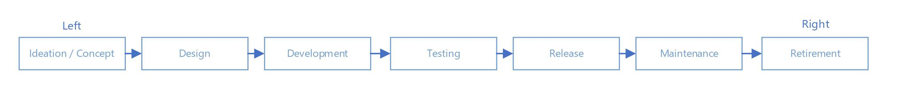
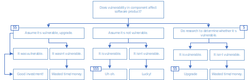
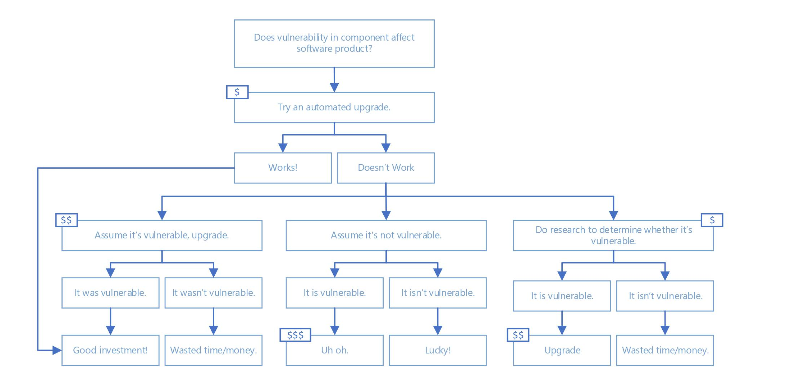
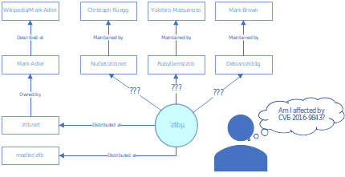

## Threats, Risks, and Mitigations in the Open Source Ecosystem

*[Michael Scovetta](mailto:michael.scovetta@microsoft.com), Microsoft*

*in collaboration with the Open Source Security Coalition*

The purpose of this document is to build a mutual understanding of the high-level threats, security risks, and potential mitigations associated with the open source ecosystem. There is a natural overlap between these threats and risks, and those that affect the more general software development process. The primary intended audience consists of members of the [Open Source Security Coalition](https://securitylab.github.com/) (the “Coalition”, herein) and similar organizations interested in promoting and advancing improvements to the security of the open source ecosystem, but should not be considered as a product roadmap or promised set of features. It should also be noted that this document focuses exclusively on security risk and does not include risks related to intellectual property (i.e. patents, copyright, licensing, contracts).

# Introduction

Open source software is an essential part of modern software development, and of practically all technology solutions. Adoption of open source software has grown over the past two decades, powering everything from tiny Internet of Things devices to the most advanced supercomputers in the world. Over the last decade, the quantity of open source available through package management systems has grown from around 30,000 to well over two million today. This has led to enormous productivity gains, allowing software engineers to focus more on solving business problems and less on creating and re-creating the same building blocks needed in many situations.

Open source itself, however, is primarily created by volunteers, working on their own time on a project they are passionate about. They often receive no monetary compensation for their work other than satisfaction that their creation is useful to others, but their work product is routinely used to power for-profit businesses and other organizations. This can create discord between the producers and consumers.

> *"Open Source & I are going through a labor dispute right now. I really lost a lot of faith in open source when I noticed billion dollar corporations were using my software and not a single one ever bothered to donate even a few dollars to keep it going, but filed tickets." - Jordon Bedwell (@envygeeks)*

Open source software brings great capability, but with it comes some amount of risk. According to the [2019 State of Software Supply Chain](https://www.sonatype.com/en-us/software-supply-chain-2019) report released by Sonatype:

- The number of days between vulnerability disclosure and exploit creation has shrunk from 45 to 3.

- Over half of JavaScript components contain at least one known security vulnerability.

- JavaScript packages are downloaded over 10 billion times per week (via NPM), which averages to more than 53,000 per developer per year.

More generally, security vulnerabilities continue to grow in number, with over 17,000 CVEs¹ published in 2019 and nearly 9,000 published in the first half of 2020. Of those 26,000, over 4,000, or fifteen percent, were rated [critical](https://nvd.nist.gov/vuln-metrics/cvss).

These are scary numbers, but they do not tell the whole story. The purpose of this document is not to promote fear, but to offer solutions and align disparate efforts toward a common goal. To move forward, we must first build a mutual understanding of the threats and risks associated with the open source ecosystem. Where applicable, we offer suggestions on ways to address the threats and mitigate the risks, but we do not presume any of this to be exhaustive. At best, we hope to start a conversation about the best way to proceed.

A summary of recommendations can be found in the [Appendix](#Appendix).

## Version History

|     |                                   |           |
|:---:|:--------------------------------- |:---------:|
| 0.1 | Initial draft                     | 4/16/2020 |
| 0.2 | Final draft                       | 5/5/2020  |
| 1.0 | Initial release                   | 5/13/2020 |
| 1.1 | Updates based on initial feedback | 6/16/2020 |

---

¹ CVEs cover both open source and proprietary software.

---

## Related Work

The following resources contain content that supplements the information to this document.

### Industry Reports

- [The State of Open Source Security Vulnerabilities](https://www.whitesourcesoftware.com/open-source-vulnerability-management-report/) (2020, WhiteSource)

- [The State of Open Source Security ](https://snyk.io/opensourcesecurity-2019/)(2019, Snyk)

- [Open Source Security and Risk Analysis (OSSRA)](https://www.synopsys.com/software-integrity/resources/analyst-reports/2019-open-source-security-risk-analysis.html) (2019, Synopsys)

- [2019 Software Supply Chain Report](https://www.sonatype.com/en-us/software-supply-chain-2019) (2019, Sonatype)

### Guidelines, White Papers, and Standards

- [Fundamental Practices for Secure Software Development](https://safecode.org/wp-content/uploads/2018/03/SAFECode_Fundamental_Practices_for_Secure_Software_Development_March_2018.pdf) (SAFECode)

- [Managing Security Risks Inherent in the Use of Third-party Components](https://safecode.org/wp-content/uploads/2017/05/SAFECode_TPC_Whitepaper.pdf) (SAFECode)

- [Microsoft Security Development Lifecycle](https://www.microsoft.com/en-us/securityengineering/sdl/)

- [NIST SP 800-160](https://nvlpubs.nist.gov/nistpubs/SpecialPublications/NIST.SP.800-160v1.pdf) (Systems Security Engineering)

- [NIST SP 800-37](https://nvlpubs.nist.gov/nistpubs/SpecialPublications/NIST.SP.800-37r2.pdf) (Risk Management Framework for Information Systems and Organizations)

- [OWASP Packman](https://github.com/OWASP/packman) (Documentation/tracking of security controls of popular package management systems)

- [OWASP Software Component Verification Standard](https://owasp.org/www-project-software-component-verification-standard/)

## Acknowledgments

Thank you to everyone who reviewed, commented, and provided content for this document; most especially to Guy Acosta, Bas Alberts, Chris Aniszczyk, Charles Brenner, Jennifer Fernick, John Gossman, Luigi Gubello, Chris Jeuell, Maya Kaczorowski, Radoslaw Karpowicz, Steve Lipner, Jason Keirstead, Dan Lorenc, Elie Saad, Andrew Trompler, and Kay Williams.

## Table of Contents

|                                                                                                         |     |
| ------------------------------------------------------------------------------------------------------- | ---:|
| [Introduction](#Introduction)                                                                           | 1   |
| [Threats & Risks](#Threats-&-Risks)                                                                     | 5   |
| [Ideation / Concept Phase](#Ideation-/-Concept-Phase)                                                   | 5   |
| [Local Development Phase](#Local-Development-Phase)                                                     | 8   |
| [External Contributions Phase](#External-Contributions-Phase)                                           | 17  |
| [Central Infrastructure Phase](#Central-Infrastructure-Phase)                                           | 19  |
| [Package Consumption Phase](#Package-Consumption-Phase)                                                 | 23  |
| [Vulnerability Reporting & Security Response Phase](#Vulnerability-Reporting-&-Security-Response-Phase) | 34  |
| [Cross-Cutting Activities](#Cross-Cutting-Tasks)                                                        | 38  |
| [Conclusion](#Conclusion)                                                                               | 47  |
| [Appendix](#Appendix)                                                                                   | 48  |

# Threats & Risks

To better frame what we’re going to be exploring, we’ll start with a simple diagram that describes the major parts of the open source ecosystem and how they often relate to one another.

We will use the diagram above to frame our exploration of threats and possible mitigations, after which we’ll discuss some general, cross-cutting practices and recommendations.

## Ideation / Concept Phase

In this phase, there are few explicit threat actors; instead, there is the potential for “business”-level security flaws, biases that have security implications, and other high-level design problems that can have severe consequences if not identified and properly addressed.

These risks can be influenced by various aspects of a system:

- **Attack Surface.** As a system’s attack surface grows or becomes less well-defined, it becomes more susceptible to attack. For example, systems that attackers have physical possession of are often harder to secure against tampering or introspection. Systems that have many dependencies could be attacked using a defect in any of them. 

- **Technology Stack Risks.** Certain technologies are inherently more susceptible to attack than others; for example, most modern programming languages have been built to avoid the memory safety challenges that have [affected](https://www.zdnet.com/article/microsoft-70-percent-of-all-security-bugs-are-memory-safety-issues/) C and other “low-level” languages.

- **Security-Sensitive Functionality.** From a security perspective, certain tasks are simply more important than others. For example, it is more important that a library that performs authentication or authorization do so correctly than it is that a calendar widget properly account for leap years. Operating system kernels, cryptographic libraries, and cloud orchestration systems also fall into this category, as do many other components that depend on the context of the system they are being used with.

- **Unproven Technology.** New technologies often offer advantages, but practically no one “gets it right” on their first try. Whether it’s a new platform, programming language, framework, or library, placing too much reliance on the security of that new technology can be a mistake until it’s been proven out.

In addition, it’s important to realize that not all risks are technical in nature; systems that perform any of the following are more likely to be attacked than others:

- Systems that transfer money or other assets between accounts.

- Systems that provide assurance that certain events have taken place.

- Systems that protect access to highly valuable assets.

- Systems that claim to provide anonymity or pseudonymity.

To mitigate these risks, security practitioners often recommend [threat modeling](https://safecode.org/wp-content/uploads/2017/05/SAFECode_TM_Whitepaper.pdf) and a security-oriented design review (also known as an architectural risk analysis). There are many approaches to performing these, and though they are often as much “art” as “science,” there are some excellent examples that are publicly available:

- [Kubernetes Security Audit and Threat Model](https://github.com/kubernetes/community/tree/master/wg-security-audit)

- [OAuth 2.0 Threat Model and Security Considerations](https://tools.ietf.org/html/rfc6819)

The main challenges around threat modeling include:

- Most software engineers do not perform threat modeling or similar activities when creating open source software. This may be due to limited understanding of the value these tasks provide, or a desire to work on the core (software) parts of the project.

- A project’s core concepts often shift over time, especially at the early in the project’s development, which means this process should be repeated regularly.

- The maintainers may change over time; there may be no one available to describe how a certain part of the project works. 

- These tasks are often difficult or require specialized training or expertise that may not be available.

- There may also be a perception that these activities don’t provide much value to open source components, especially since the developer will not have the context of how the component will be ultimately used.

### Threat Modeling

Formally, threat modeling is a process by which potential threats are identified and rated for severity, and possible mitigations are discussed. Less formally, threat modeling happens when you think about how the system you’re building could be broken, and consider what you can do to prevent that from happening.

It is important to stress that threat modeling is a <u>process</u>, not a tool. While tools can help the process be more efficient (e.g., by providing visualization, tracking changes over time, or identifying changes to software that would be more likely affect its threat model), tools by themselves cannot currently take the place of humans reasoning about how other humans would attack a system.

Threat modeling can be most effective when multiple stakeholders can come together to look at a system from different angles: developers, architects, service engineers, designers, and end users, along with security specialists. The discussion can be as simple as walking through how the system is used, how it is *supposed* to work and comparing that to how it *actually* works. Security specialists will often ask questions to get a better understanding of the security controls in place, and very often, everyone will leave with a better understanding of the risks that affect the system.

There are tools, like [OWASP Threat Dragon](https://owasp.org/www-project-threat-dragon) and [SD Elements](https://www.securitycompass.com/sdelements/), that bring structure to this process, and many good tutorials, including [Threat Modeling in 2019](https://www.youtube.com/watch?v=ZoxHIpzaZ6U) (RSA/Adam Shostack, 2019) and the SAFECode [Tactical Threat Modeling](https://safecode.org/safecodepublications/tactical-threat-modeling/) white paper.

We recommend considering the following projects to advance this area:

- High-quality training materials for conducting threat modeling and a security-oriented design review should be curated or created and targeted at high-risk projects.

- Templated threat models should be created for common (and representative) types of open source components and expanded over time with community involvement.

- Experienced security professionals should collaborate with critical, high-risk open source projects to create security reviews and associated threat models.

## Local Development Phase

Local development of open source projects usually takes place on the maintainer’s personal infrastructure (workstations, local network, etc.), which, like any other infrastructure, can be vulnerable to attack. For example, [XcodeGhost](https://en.wikipedia.org/wiki/XcodeGhost) was a malicious distribution of Apple’s Xcode software, targeting the far left of the supply chain—the developer’s IDE and local build environment. Similar attacks have become more common, such as the [eslint-scope malware](https://nodesource.com/blog/a-high-level-post-mortem-of-the-eslint-scope-security-incident/) that attempted to exfiltrate the developer’s NPM access tokens during installation.

Threats that apply to this phase include:

- Attackers compromise a developer’s environment and use that access to compromise the software components themselves (e.g., making false commits, silently pushing content to a source code repository, modifying files, etc.).

- Attackers compromise a developer’s environment in order to exfiltrate commits not made public yet in order to be a step ahead in the competition.

- Attackers compromise a maintainer’s machine, network, or communications tools to intercept researcher-submitted bug reports of zero-day vulnerabilities.

- Developers leave “debug” functionality that bypasses security controls.

- Developers copy/paste source code from Stack Overflow or similar sources without considering whether that code contains security defects.

- Maintainers create software with code-level security defects (vulnerabilities).

- Maintainers accidentally check secrets into source code or publish them in packages, which attackers find and exploit.

### Technical Architecture

The choice of a technical architecture can have a significant impact on the overall security of a system and the investment needed to keep that system secure in the future. A good (secure) technical architecture can mitigate security risk systemically, while poor technical architectures can amplify it. Our goal in choosing a secure technical architecture is to reduce the likelihood that the system will contain exploitable security vulnerabilities in the future.

As an example, consider security vulnerabilities that result from inconsistencies created when a concept is translated into a program’s source code. For example, a developer may assume that a person’s age will never be greater than 120, so they assign an 8-bit field to store it; an attacker submits a record with an age of 100 million, and the program state overflows, resulting in corruption and potential execution of code supplied by the attacker.

Tactically, bugs like this can often be found through static analysis or fuzzing, but one of the best ways to address entire classes of vulnerabilities is to provide software developers programming languages and platforms that make it easier to write secure code. For example, many modern “managed” programming languages avoid manual memory management; in the above example, an attacker supplying a number greater than the allowed size would result in a runtime error rather than memory corruption.

Memory management issues obviously aren’t the only kind of security flaws, however, and many higher-level constructs cannot be feasibly handled at the programming language level, such as a properly-implemented authorization mechanism or the implementation of a new cryptographic protocol. For many of these cases, having well-vetted, commonly used libraries that implement these constructs has advantages over each package author implementing the construct independently. (Indeed, this is one of the primary benefits of using open source software in the first place!)

The [MITRE Common Weakness Enumeration](https://cwe.mitre.org/data/slices/699.html) breakdown is a good resource for understanding the range of issues that can affect a system.

Platform and framework selection can also have a significant impact on the security of an overall system. For example, containers have been ubiquitous in modern software development, but it can be easy to accidentally expose host resources to the container environment, reducing any security protections such a configuration would normally provide.

We recommend the following activities in this area:

- Guidance should be created or curated that describes how to securely configure some of the most common platforms and frameworks (e.g., Docker, Kubernetes, Node/Express). 

- References to high-quality, “batteries included” libraries and frameworks like [ESAPI](https://owasp.org/www-project-enterprise-security-api/) and [Python/Cryptography](https://cryptography.io/en/latest/) should be collected and curated centrally.

- Guidance should be created or curated to help developers choose or design secure technical architectures, with easy-to-understand examples.

### Writing Code

All software contains flaws, and those flaws can often impact the security quality of a system. There is clear consensus that the best time to detect and fix security flaws is early in the development process, but this understanding does not always translate into clear action. Many teams apply some sort of analysis, ranging from linters to advanced static analysis tools.

There are a few different options for addressing exploitable vulnerabilities:

- [Identifying Security Vulnerabilities in Source Code](#Identifying-Security-Vulnerabilities-in-Source-Code) (Detect)

- [Identifying Security Vulnerabilities During Execution](#Identifying-Security-Vulnerabilities-During-Execution) (Detect)

- [Reducing the Likelihood that a Vulnerability will be Introduced](#Reducing-the-Likelihood-that-a-Vulnerability-will-be-Introduced) (Prevent)

- [Reducing the Likelihood that a Vulnerability will be Exploited](#Reducing-the-Likelihood-that-a-Vulnerability-will-be-Exploited) (Prevent)

#### Identifying Security Vulnerabilities in Source Code

Static analysis is a term used to describe the process for examining a program outside of its running state (i.e., source code) in an attempt to identify vulnerabilities that would be present if the program were running. These techniques range from simple pattern matching, to analysis of control and data flow graphs, to program emulation, to formal methods for validating pre- and post-conditions.

The quality of static analyzers has increased in recent years, and while you shouldn’t expect perfect accuracy, these tools can often detect exploitable security vulnerabilities before they are even merged into an official code branch. 

Challenges of using static analysis include:

- **Cost.** Open source projects cannot usually afford to pay for a commercial static analysis tool. Fortunately, most are available for free to open source projects, including [LGTM](https://lgtm.com) (GitHub), [Coverity](https://scan.coverity.com/), and [Reshift](https://www.reshiftsecurity.com/). A fairly comprehensive list of static analysis tools can be found on [Wikipedia](https://en.wikipedia.org/wiki/List_of_tools_for_static_code_analysis).

- **Inability to Analyze.** Most static analyzers are language-dependent, meaning that if the tool supports only Java and C#, but your project is written in PHP, then the tool won’t provide you much value. In the worst case, you may be using a programming language for which no analysis tools exist. Analyzers also tend to have challenges when tracing execution between different programming languages (e.g., data coming from a web application, passing through a backend application, to a separate micro-service, and then to a NoSQL store).

- **Complexity to Analyze.** In the best case, analysis is simple: you push a button, analysis runs, and findings are generated. However, depending on the analyzer, you may need to spend additional time configuring it; at scale, this hurdle could stand in the way of many open source projects from adopting static analysis.

- **Cost/Time to Review.** Once a static analysis tool is used, findings need to be reviewed and appropriately actioned. For open source projects, especially those with large code bases, this work can be substantial, especially when it is done for the first time. 

The best way to address these challenges is through improved tools: more accurate rules, better guidance on how to remediate, “turn-key” execution, and broader support for modern and emerging platforms and architectures. We therefore recommend the following:

- Build (and meta-build) systems should improve integration with static analysis tools, enabling “default on” high-quality analysis.

- [GitHub Security Lab](https://securitylab.github.com/) should continue to support community development of security rules and should drive toward “on by default” static analysis within source code repositories.

- Research should be directed toward a standard (cross-tool) format for expressing detection rules, enabling more efficient use of security engineering activities.

- Research should also be directed toward advancing the state of the art around “auto-fixes”, which would be the ability for a static analysis tool to automatically submit a pull request with the required code change to remediate a vulnerability. (We’re under no illusion that this would be difficult or impossible to solve in the general case, but there is plenty of “low-hanging fruit” for which this seems reasonable.)

##### Stack Overflow

An increasingly common development practice is to make extensive use of Stack Overflow. While there isn’t anything wrong with this per se, [many](https://arxiv.org/pdf/1910.01321.pdf) of the answers provided contain [security defects](https://www.ieee-security.org/TC/SP2017/papers/7.pdf), and copying/pasting those answers [can lead to vulnerabilities](https://stackoverflow.blog/2019/11/26/copying-code-from-stack-overflow-you-might-be-spreading-security-vulnerabilities/). While static analysis can be used at the point of consumption to identify vulnerabilities, it would be more efficient to address the source.

We therefore recommend:

- Source code snippets submitted to Stack Overflow should be analyzed, with feedback going to either the author or the public. Readers should be made aware of vulnerable snippets. (The Coalition should consider engaging with Stack Overflow to advocate for a solution integrated into the Stack Overflow experience.)

- To address existing snippets already available on Stack Overflow, a separate analysis could take place, looking for vulnerable code patterns, and recommending fixes or at least commentary alerting individuals potentially affected by the vulnerability.

#### Identifying Security Vulnerabilities During Execution

While most security defects can be theoretically found using static analysis, in practice, static analysis tools are only as good as the rules implemented, and are often language-dependent. As a result, software developers often use tools that actively validate a program as it’s running, through a variety of methods:

- Dynamic Application Security Testing (DAST), which involves feeding data to a running application in order to “break” it in some way. Examples of this include fuzzing tools like Google’s [OSS-Fuzz](https://github.com/google/oss-fuzz) and web application penetration testing tools like [OWASP Zed Attack Proxy (ZAP)](https://www.zaproxy.org/).

- Interactive Application Security Testing (IAST), which involves instrumenting the application to achieve better accuracy when detecting vulnerabilities. Examples of this include memory checkers like [Valgrind](https://valgrind.org/) and [AddressSanitizer](https://clang.llvm.org/docs/AddressSanitizer.html). 

- Runtime Application Self-Protection (RASP), which involves instrumenting the application to detect and sometimes prevent attacks. An example of this is a web application firewall.

It may be tempting to only consider execution-time security testing for freestanding applications, like a database or web server, but this would be incomplete. Just as unit tests exist to validate individual pieces of functionality, so too can the active testing techniques described above apply to individual components.

We recommend the following:

- Build (and meta-build) systems should improve support for plugging into fuzzing tools.

- We should advocate for increased use of execution-time tools for open source projects.

#### Reducing the Likelihood that a Vulnerability will be Introduced

In an ideal world, all security defects would be identified immediately, enabling the software developer to fix them prior to ever being checked in. In the real world, security defects are found at all times throughout the lifecycle, but there are obvious advantages (risk, [cost](https://www.researchgate.net/publication/255965523_Integrating_Software_Assurance_into_the_Software_Development_Life_Cycle_SDLC), etc.) to identifying these as early as possible. This is often referred to as “shifting left”, based on a simplified view of the development lifecycle:

In order to “shift left” as much as possible, software developers require access to high-quality guidance on how to address common classes of software vulnerabilities. While there are some high-quality sources available, including the [OWASP](https://owasp.org) [Cheat Sheet Series](https://cheatsheetseries.owasp.org/), few are comprehensive, curated, and kept up to date. 

We recommend the following take place:

- Provide developers with the [proper training](#Secure_Education) required to introduce and implement security in the technology stack being used at hand.

- Provide developers with a curated list of security tools and related resources.

- Provide developers with technical expertise when needed, particularly for critical projects.

#### Reducing the Likelihood that a Vulnerability will be Exploited

All software contains defects, and some of those defects have security implications. Over the past two decades, considerable work has gone into making it harder for these security defects to be successfully exploited by an attacker. Indeed, just as in the physical world, secure facilities have more than one “lock”, secure software systems have more than one control to prevent abuse. This “defense in depth” is a hallmark of secure software and can have a significant impact on the overall security and resilience of a system.

Moreover, there are various types of software vulnerabilities. There are also various exploitation techniques for performing attacks using the vulnerabilities. So building security architecture of a system requires understanding of the relationships between:
 - Bug detection mechanisms,
 - Defense technologies,
 - Vulnerability classes,
 - Exploitation techniques.

For example, [Linux Kernel Defence Map](https://github.com/a13xp0p0v/linux-kernel-defence-map) shows such relationships for the Linux kernel. This map is useful for developing a threat model for your GNU/Linux system and then learning about kernel defenses that can help against some of these threats.

In practice, this work also takes the form of security controls implemented within the platform, runtime, or operating system that will identify when the application is doing something unexpected, and take some form of corrective action. Examples include:

- An application-level firewall notices patterns associated with [Cross-Site Scripting (XSS)](https://owasp.org/www-community/attacks/xss/) or [SQL Injection](https://owasp.org/www-community/attacks/SQL_Injection), and blocks traffic from getting to the application.

- [Address Space Layout Randomization](https://en.wikipedia.org/wiki/Address_space_layout_randomization) (ASLR) reduces the likelihood that a buffer overflow will escalate to arbitrary code execution, by placing shared libraries at random locations in memory.

- Android applications request specific [permissions](https://source.android.com/devices/tech/config), which the user must grant during installation. (Access beyond those granted permissions will blocked by the operating system.)

We recommend the following projects in this area:

- Create guidance on how to leverage binary- and platform-level mitigations when building or deploying systems; this could include activities like enabling [Control Flow Integrity](https://clang.llvm.org/docs/ControlFlowIntegrity.html), avoiding [speculative execution](https://www.kernel.org/doc/html/latest/admin-guide/hw-vuln/spectre.html) attacks, and enforcing [address space layout randomization](https://en.wikipedia.org/wiki/Address_space_layout_randomization).

- Analyze state-of-the-art techniques for binary hardening across different operating systems; start work on porting techniques where there are significant differences, if any. For example, [kconfig-hardened-check tool](https://github.com/a13xp0p0v/kconfig-hardened-check) provides the recommendations that you can use for hardening the Linux kernel on your systems.

- Implement a “capabilities” model into one or more programming language runtimes.

#### Fixing Vulnerabilities

Once a vulnerability is identified and understood, the next obvious task is to fix it. In the ideal scenario, the project maintainer(s) will create a fix, test it, and publish a new release. Consumers (i.e., end-user and downstream package maintainers) will begin to use the new release, and the risk from the vulnerability would be mitigated. Unfortunately, there are often reasons why a prompt fix is not made:

- The maintainer(s) may not be actively working on the project. For side projects (see [Project Archetypes](#Project-Archetypes)), maintainers may issue a fix, but only at their convenience.

- The vulnerability may be categorized as low risk by the maintainer and perceived as not  being worth the effort to fix.

- The vulnerability may require significant effort to fix, either due to complexity, compatibility issues with other components, or simply due to the amount of code that will need to be modified.

In all of these cases, the larger community can put undue pressure on the project maintainer, who is often working on the project without compensation or may have other priorities. This can stand at odds with the consumers of that project, who are often employed: corporate developers who are being compensated to deliver a software product.

It is important to note that the scenario above is not the only possible workflow:

- The security researcher who found the vulnerability may contribute a code fix or may even join the project as a maintainer.

- The “fix” may be incomplete, and its revelation may encourage attackers to target instances of the software that are now known to be vulnerable.

- The security researcher may be unwilling to wait for a fix (particularly, a delayed one) and may therefore release the details publicly, including in some cases, a fully “weaponized” exploit.

A reasonable metric around fixing vulnerabilities could be the elapsed time between when a vulnerability is first identified and when all users have updated the package to a fixed version (up to some threshold). However, it makes sense to split this metric into two separate parts:

- The elapsed time between when a maintainer is notified and when a (correctly) fixed version is made available to consumers.

- The elapsed time between when an updated version is available and when it becomes integrated into the downstream project.

These metrics cannot be completely separated from one another; for one thing, many open source projects are both consumers of upstream packages and providers of packages to downstream consumers. Consider the following:

In this scenario, think of yourself as a software developer using Component D. A vulnerability in Component A is found on January 1st and fixed ten days later. Downstream packages pick up the fix, one by one, until Component D issues a release in mid-March, which you notice and update at the end of March. Depending on the specifics of the vulnerability, you could have been affected by this publicly-known vulnerability for over two months, even though everyone was issuing fixes in a reasonable timeframe.

Services like [Snyk](https://snyk.io/) and [Dependabot](https://github.blog/2019-05-23-introducing-new-ways-to-keep-your-code-secure/#automated-security-fixes-with-dependabot) (now part of GitHub) can significantly shorten these delay chains by automatically opening pull requests when vulnerabilities are fixed in dependencies. 

We recommend the following:

- Consideration should be given to funding high-impact projects that contain security vulnerabilities, possibly using a model similar to the [Core Infrastructure Initiative](https://coreinfrastructure.org).

- Educational material should be created to advocate for projects to keep open source packages up to date, even in the absence of any known security flaws. (See Package Update for additional discussion of this topic.)

- Bug bounties should be created or expanded to include rewards for (accepted) patches, under the assumption that a project maintainer will be more likely to accept a quality pull request than to take the time to investigate and create a fix themselves. (Google’s [patch rewards program](https://www.google.com/about/appsecurity/patch-rewards/) is a good example of this.)

- A funded pool for software engineers could be created and directed at high-risk situations, such as creating fixes for vulnerabilities in critical projects.

### Secrets Management

Secrets Management is the practice of ensuring that credentials, tokens, cryptographic keys, and other sensitive material is not unexpectedly disclosed. This disclosure can occur in many scenarios, including:

- [Secrets disclosed in source code when pushed to a source code repository](https://darkport.co.uk/blog/ahh-shhgit!/)

- [Secrets disclosed in a published package](https://thenewstack.io/npm-password-resets-show-developers-need-better-security-practices/)

- [Secrets disclosed in artifacts from a CI/CD pipeline](https://blog.travis-ci.com/2017-05-08-security-advisory)

- [Secrets disclosed to unauthorized entities when a package is installed or is executing](https://www.zdnet.com/article/microsoft-spots-malicious-npm-package-stealing-data-from-unix-systems/)

The effect of this disclosure is that very often, the secrets themselves can allow an attacker to masquerade as the victim (i.e., package author, publisher, or consumer).

A number of mitigations exist that address this, including:

- Tools, such as [truffleHog](https://github.com/dxa4481/truffleHog) and [shhgit](https://shhgit.darkport.co.uk/), identify secrets disclosed in source code, and can be used at appropriate points in the development lifecycle (i.e., pre-commit or pre-receive hooks).

- Centralized (and well-protected) secret management services can be used to protect, rotate, and audit secrets more effectively.

- Many CI/CD pipelines contain features that enable secrets to be inserted at runtime and protected from disclosure in logs or other artifacts.

- Modern software deployment practices (e.g., micro-services, serverless architectures, containers, etc.) reduce the likelihood that an untrusted process will be able to read secrets from the target (though they do increase the attack surface area).

We recommend the following projects to advance this area:

- Expand secret detection capabilities in key systems, including source code repositories (e.g., GitHub, Gitlab, etc.) and package management systems (e.g., NPM, PyPI, etc.).

- Reach out to the maintainer of [truffleHog](https://github.com/dxa4481/truffleHog) to help improve/extend the tool (there are currently 36 open pull requests), or rally around another tool to achieve the same ends: a high-quality secrets detector.

- Create “play books” on how it can be fast and simple to use a secure secret management facility.

- Include secrets management in key best practice documentation to developers.

### Dependency Management

When authoring a software project, it’s typical to bring in dependencies for functionality that you don’t want to implement yourself, and is done by both the developers who create final software products as well as the developers who create open source components.

We discuss dependency management as part of Package Consumption, later in this document.

### Local Testing

Testing often takes place both locally (usually informally) and within a formal build pipeline. We discuss testing within the Security Validation section, later in this document.

## External Contributions Phase

In this phase, we explore changes made to a software component by a loosely-affiliated individual, which is to say not by the main author or trusted maintainer. This contributor can be trustworthy or underhanded, and the contribution itself can be of any level of quality. Most open source projects have a way to validate and accept (or reject) these contributions, and the most common way is through a pull request.

When a contribution is made, a maintainer usually needs to “sign off” on the change before merging it into an “official” code branch.

In this phase, we have the following threat actors:

- [An attacker trying to “sneak” a malicious change into a code base.](#Preventing-Malicious-Changes-from-Contributors)

- [An attacker can attempt to undermine the pull request validation infrastructure.](#Undermining-Automated-Validation-on-Pull-Requests)

### Preventing Malicious Changes from Contributors

Typically, pull requests are validated through some combination of automated tools and manual introspection. Tools often cover things like ensuring a Contributor License Agreement (CLA) is in place for corporate organizations, that code passes unit tests, meets style requirements, passes linting, or is free of (detectable) security vulnerabilities. Unfortunately, attackers would be able to mimic these checks locally, tweaking their contribution until it passes. As a result, manual introspection is an essential part of accepting pull requests.

This risk can be mitigated to some degree by:

- Ensuring that all contributions from less-trusted parties are reviewed, preferably by two maintainers, before they is merged.

- Ensuring that all security tools are run successfully before completing a pull request.

- Ensuring that all changes to the component’s attack surface or core characteristics are properly reviewed, using tools like [Microsoft Application Inspector](https://github.com/Microsoft/ApplicationInspector) and the [NPM Security Insights API](https://blog.npmjs.org/post/188385634100/npm-security-insights-api-preview-part-2-malware).

However, we strongly suspect that manual introspection of malicious, intentionally obfuscated changes will not be entirely effective. To prove this out, we recommend a “red team” exercise be performed to ascertain the likelihood that a “hidden” change will pass through a code review.

### Undermining Automated Validation on Pull Requests

Tools are often used to validate that a pull request meets some type of quality bar. This often involves performing a build and running unit tests and other tools to detect issues.

A modern coding practice is to include build scripts, configuration, and unit tests within the project’s source code repository. This means that an attacker could submit a pull request that, for example, disables both a security feature and its associated unit test. Validation would “pass” and only a manual review would detect this change as suspect. 

However, an attacker would also be able to do things like exfiltrate any secrets accessible to the build environment or execute arbitrary code (via a build script) within that environment.

Many continuous integration systems have built controls to mitigate the risk of disclosing secrets, including [GitHub Actions](https://github.community/t5/GitHub-Actions/don-t-run-actions-on-pull-request-from-fork/td-p/45499), [Azure DevOps](https://docs.microsoft.com/en-us/azure/devops/pipelines/repos/github?view=azure-devops&tabs=yaml#validate-contributions-from-forks), [Travis CI](https://docs.travis-ci.com/user/pull-requests#Pull-Requests-and-Security-Restrictions), and [CircleCI](https://circleci.com/blog/managing-secrets-when-you-have-pull-requests-from-outside-contributors/). This is often implemented by not passing secrets to pull requests initiated from forked repositories.

To mitigate the remaining risks, we recommend:

- Any changes to build configurations should be validated, similar to any other change.

- All pull request validation routines should be limited to an expected duration and frequency, in order to avoid denial of service or resource exhaustion.

## Central Infrastructure Phase

“Central Infrastructure” refers to elements in the open source supply chain that are typically operated “as a service” by a trusted third party (e.g., GitHub, NPM, Travis CI, Azure DevOps, etc.). This has advantages to both the maintainer (lower cost and complexity, high quality, etc.) and consumer (increased trust), but some threats apply here.

### Source Code Repository

First, attackers could target the source code repository. Despite most open source development now using a distributed source control system (git), most source code is stored in a central location, such as GitHub, Bitbucket, GitLab, or Azure DevOps. New developers (or existing developers performing a git clone-style operation) would have a hard time determining the authenticity of a repository if it were modified by an attacker.

This threat is already mitigated by strong operational security practices that these central organizations employ, and can be further mitigated by increased use of [commit signing](https://git-scm.com/book/en/v2/Git-Tools-Signing-Your-Work) with central trust authorities.

The open source developer’s credentials could also be hijacked by an attacker. With those credentials, the attacker could modify the source code available, perform builds, and trigger publishing pipelines—essentially, anything the “real” maintainer could do). This risk is mitigated to a large extent by the use of multi-factor authentication, but could be expanded to include anomaly detection (e.g., requiring an additional layer of authentication if an action is triggered from an unexpected location, or based on other metadata).

### Security Validation

Security validation usually either takes place on a developer’s local workstation or centrally once changes have been made to a source code repository. We’re using the term “security validation” to include things like static analysis, automated penetration testing, fuzzing, and related tasks—the goal of which is to identify security defects so they can be fixed before they can be found by an attacker and exploited.

There are a few threats that pertain to this phase of the development lifecycle, including:

- [An attacker learns of security defects prior to a fix being available.](#Premature-Disclosure)

- [An attacker is able to disable certain security checks from taking place.](#Attacker-Disabling-Security-Checks)

- [An attacker is able to author a malicious contribution that isn’t identified when analyzed.](#Malicious-Contributions)

#### Premature Disclosure

Premature disclosure occurs when a tool is used to identify security defects in a system or software component, but the results wind up being disclosed to an attacker before they can be remediated.

There is room for argument here on whether full, public disclosure leads to better outcomes, with market forces putting pressure on maintainers (or other contributors) to fix security defects. After all, we should assume that most attackers will be able to perform the same validation activities themselves. On the other hand, security is often about increasing the cost to an attacker, and providing a public list of vulnerable components could certainly lead to more successful attacks.

An additional point here concerns the level of triage involved. Security tools can often yield a large number of false positives: either completely invalid findings or those that cannot be exploited for one reason for another. The value to an attacker of un-triaged findings is far less than the value of those that have been validated as high-impact—the latter approaching the realm of [Responsible Disclosure](https://en.wikipedia.org/wiki/Responsible_disclosure).

We recommend the following:

- Research should be conducted, reviewed, or consolidated to come up with the right policy on public disclosure of un-triaged and minimally triaged findings from automated security tools.

- Funding should be considered to triage potentially high-impact security findings detected by certain tools (e.g., [lgtm.com](https://lgtm.com) and others).

#### Attacker Disabling Security Checks

If an attacker is able to change the configuration of security checks, they would be more likely to be able to “slip something by” the security validation process and insert vulnerable or malicious code into the software component.

As a result, all changes to the security configuration (e.g., [lgtm.yml](https://lgtm.com/help/lgtm/lgtm.yml-configuration-file)) should be examined by a human to ensure they don’t, for example:

- reduce the severity of certain defect types,

- ignore certain paths,

- change build commands, or

- change alerting or notification settings.

We recommend the following:

- Research should be performed to determine the feasibility of this attack and what types of mitigation could help. Specifically, a “red team” exercise should be performed, to attempt to undermine the security checks performed against a project created for this purpose.

#### Malicious Contributions

Most open source projects accept contribution requests from anyone in the form of pull requests. An attacker could attempt to “trick” a maintainer into accepting their contributions, through a few different means:

- **Minified Code.** Changes made to minified code can be very difficult to read, especially with a line-by-line view of the differences. (Though to be clear, minified code should probably be the output of a build process, and therefore not checked into a source code repository in the first place.)

- **Many good changes, one bad one.** If an attacker has provided multiple “good” changes, especially over time, the maintainer may relax their guard and accept a subsequent change without reviewing it as much. Similarly, if a single pull request had hundreds of similar changes (e.g., “fix indenting”), it may be hard to find the malicious change.

- **Homoglyphs.** Homoglyphs can be problematic because the text will “look correct” to a human reviewer but will actually be different, leading the victim to an alternate library.
  
  *Can you spot the difference?*
  
  |     |     |     |      |     |     |     |
  |:---:|:---:|:---:|:----:|:---:|:---:|:---:|
  | l   | e   | f   | t    | p   | a   | d   |
  |     |     |     | *vs* |     |     |     |
  | ⅼ   | е   | f   | t    | р   | а   | ⅾ   |
  
  *In the bottom table, six of the seven characters are from “non-ASCII” character sets defined by Unicode.*

- **Large Diffs.** GitHub does not show large diffs by default, and instead shows a “load diff” link, which can be easy to miss, [especially in lock files](https://snyk.io/blog/why-npm-lockfiles-can-be-a-security-blindspot-for-injecting-malicious-modules/).

- **Binary Files.** Most pull request review systems do not render differences made to binary files, leaving it up to the maintainer to review these out-of-band.

We recommend the following:

- Research should be performed to determine the feasibility of this attack and what types of mitigation could help (such as improvements to the pull request review user interface). Specifically, an adversarial “red team” exercise should be undertaken to attempt to submit malicious changes to a target repository created for this purpose.

### Continuous Integration & Delivery

Within a continuous integration and delivery environment, there is some increased risk that vulnerable or malicious content will make its way out to a published package without being detected. Indeed, many of the friction-reducing practices that enable agile development also enable faster “time to market” for “bad” code. If a dependency is updated and all tests pass, a malicious change could make its way into a published package in a matter of seconds.

It is important to consider the principles and practices of [DevSecOps](https://www.csoonline.com/article/3245748/what-is-devsecops-developing-more-secure-applications.html) and how they can be applied within the CI/CD context. Some useful resources with specific recommendations and walkthroughs include:

- [Every Security Team is a Software Team Now](https://www.youtube.com/watch?v=8armE3Wz0jk) (Dino Dai Zovi, Black Hat USA 2019)

- [Building Secure & Reliable Systems](https://landing.google.com/sre/books/) (Google)

- [DevSecOps - Implementing Secure CI/CD Pipelines](https://www.youtube.com/playlist?list=PLjNII-Jkdjfz5EXWlGMBRk63PC8uJsHMo) (YouTube)

- [A Primer on Secure DevOps: Why DevSecOps Matters](https://techbeacon.com/security/primer-secure-devops-why-devsecops-matters) (Chris Romeo, TechBeacon)

- [Six Pillars of DevSecOps](https://cloudsecurityalliance.org/artifacts/six-pillars-of-devsecops/) (Cloud Security Alliance)

### Package Publishing

The act of publishing a package to a package management repository usually starts with the maintainer establishing an account within that ecosystem, and then performing some action that ends with a package being available for consumers to select and install.

The main threat here is that an attacker would gain access to the maintainer’s credentials, either during account creation, access, or publishing, and use those credentials to perform malicious activities. This could occur through a local attack on the maintainer, an attack on the network or DNS infrastructure, or an attack closer to the central package management infrastructure.

## Package Consumption Phase

Package consumption is the process through which “external” packages are chosen and integrated into a software component. In this case, package consumption actually refers to two similar things:

- An “end-user” selects an OSS component to use in their software product.

- An OSS author selects an OSS component to use within their OSS component.

In both of these cases, we’ll refer to “end-user” and OSS author generically as “consumer”.

### Package Selection

From a consumer’s perspective, things begin when they are searching for a package to consume. This often takes place on the package management system’s web page or through a command line (e.g., `pip search mysql or apt-cache search mail`). 

Threats that apply to package selection include:

- [An attacker could compromise a maintainer’s credentials and publish malicious packages.](#Account-Hijacking)

- [An attacker could subvert the package selection client software.](#Compromised-Package-Repository-Client-Software)

- [An attacker could compromise the website that displays the package listings.](#Compromised-Package-Repository-Websites)

- [An attacker could create a new package with a name similar to an existing package (i.e., typo-squatting).](#Typo-Squatting-Attacks)

- [An attacker could modify an existing package within a package management repository.](#Compromised-Package-Repository-Packages)

- [An attacker could remove a component from a package management repository.](#Package-Removal)

#### Account Hijacking

Open source software developers nearly always publish source code and packages to centralized systems, such as GitHub and NPM. These systems typically require credentials in order to perform certain tasks, like publishing a new release, and attackers have frequently targeted open source developers as a vector to publish malicious code.

To combat this, practically all source code repositories and package management systems have implemented some form of multi-factor authentication when logging in. Unfortunately, many, if not most, developers do not take advantage of this. In addition, CI/CD pipelines can make multi-factor authentication difficult or impossible, and so alternatives like IP restricted limited-scope tokens are used. These are not ubiquitous, and as a result, attackers continue to hijack accounts and publish malicious code on a regular basis.

To combat this, we recommend the following:

- Each package management system should expose a flag (and related information) indicating whether a package was published under an account that used a strong authentication method. This should be announced far in advance, to give users ample opportunity to enable this.

- Each package management client should expose a flag that gives package consumers control over whether or not they allow packages that do not use a strong authentication method (e.g., `--flag-strong-auth=[silent|warn|fail]`).

- An analysis should be conducted of the top package management systems, documenting best practices, and sharing them with the broader package management community.

#### Compromised Package Repository Client Software

Modern CI/CD systems partially mitigate the threat of compromised client software, in that official builds are performed in a more trusted environment than the developer’s local workstation. Those builds would (presumably) select packages as expected.

#### Compromised Package Repository Websites

Most (if not all) package repositories can be browsed through a website (e.g., [npmjs.com](https://npmjs.com), [nuget.org](https://nuget.org), [pypi.org](https://pypi.org)). If these were to be compromised by an attacker, packages and metadata could be changed that would steer users to malicious packages that appeared to be authentic. This threat is mitigated (somewhat) when the organizations that manage these resources are sufficiently resourced to maintain a strong security posture.

#### Typo-Squatting Attacks

Typo-squatting occurs when an attacker creates a resource with a name closely resembling an existing name, specifically with the intent of having victims accidentally type the wrong name and access the attacker’s resource. In the context of package management systems, these resources are typically package names (e.g., `djamgo` masquerading for `django`), and they occasionally cross package management systems (`python-dateutil` being available on PyPI; `python3-dateutil` is the name of the Ubuntu package).

Typo-squatting can be largely mitigated by validating project names when they are published, using indicators like glyph similarity, keyboard distance, edit distance, and related metrics, and taking action when a package’s name is too close to the name of an existing package. Simple solutions like comparing the number of installations of a package may also provide value (e.g., *I see you’re trying to install **momenr**, which has had 4 installations. Did you mean **moment**, which has had 40 million installations?*).

We recommend the following:

- All package management systems should implement measures to detect or prevent package typo-squatting, to reduce the likelihood that an attacker will be able to publish a package that masquerades a different, authentic package. This information could either be actioned centrally and/or be conveyed to the package consumer at selection time.

#### Compromised Package Repository Packages

If an attacker were able to compromise a package repository’s storage or distribution system, it would enable them to replace an existing package with a malicious version. Since in most cases, trust is anchored to the repository itself, victims who consume the malicious package would have no way of detecting this.

Certain package management systems (e.g. [Ubuntu PPAs](https://help.launchpad.net/Packaging/PPA/InstallingSoftware), [NuGet Package Signing](https://docs.microsoft.com/en-us/nuget/create-packages/sign-a-package)) provide package signing that roots run at least partially to the package author or maintainer, rather than the repository. Others provide [repository signing](https://devblogs.microsoft.com/nuget/introducing-repository-signatures/) that mitigates the risk of a mirror being compromised. The Go ecosystem uses a [notary mechanism](https://go.googlesource.com/proposal/+/master/design/25530-sumdb.md) for ensuring that cryptographic checksums of modules do not change after they are initially published.

#### Package Removal

In addition to being immutable, many software developers generally assume that packages will always be available. Even allowing for periodic network and infrastructure outages, often little consideration is given to a scenario where a maintainer removes a package from a repository.

This became a problem in March 2016 when the author of 273 NPM packages [removed them all](https://kodfabrik.com/journal/i-ve-just-liberated-my-modules) after a legal/trademark argument. As a result, any build that used one those packages (and did not have a cached copy available) began to fail.

A related threat would occur if only certain versions were removed, requiring consumers to downgrade to older, less secure versions. One possible scenario is that an intellectual property claim could be made against only certain versions of a package.

If a package is removed entirely, and the package name then becomes available for others to register, an attacker would be able to take advantage of this. Similar to typo-squatting, this would be analogous to forgetting to renew a domain name registration and having a domain squatter take it over and use it to distribute malware.

We recommend the following:

- The scope of this problem should be researched, meaning, for each of the major package managers, what is the process for un-publishing a package? How many packages are un-published, and how many installations were they associated with? How many of those were taken down for a non-security reason? When packages are delisted, do the names become available for others to register?

- Each package management system should clearly describe its principles and process for package removal.

### Package Installation

The package installation process usually includes a few different steps, and starts once a package is selected:

- Retrieving and processing metadata about the location of the package.

- Retrieving the actual package contents.

- Validating that the package contents have not been tampered with.

- Extracting those contents into a location on the local file system.

In many cases, an additional step is added:

- Executing an installation script included within the package.

Each of these steps can be subverted in different ways:

- [Network attacks on package installation](#Network-Attacks-on-Package-Installation)

- [Local attacks on the build system configuration](#Local-Attacks-on-the-Build-System-Configuration)

- [Malicious installation scripts](#Malicious-Installation-Scripts)

- [Installation of opaque binaries](#Installation-of-Opaque-Binaries)

#### Network Attacks on Package Installation

Network-layer attacks can modify metadata and package contents while in transit to the consumer. The nearly universal use of TLS significantly reduces this risk, and to a lesser extent, so does the use of private package repositories. Many package management clients offer the ability for developers to disable certificate checking (e.g., [NPM](https://docs.npmjs.com/misc/config#strict-sslhttps://docs.npmjs.com/misc/config#strict-ssl), [PyPI](https://pip.pypa.io/en/stable/reference/pip/#cmdoption-trusted-host)), but doing so is [generally discouraged](https://arxiv.org/pdf/1709.09970.pdf) on [Stack Overflow](https://stackoverflow.com) and other forums.

Network-layer attacks may also pertain to private package repositories, which could be configured without TLS under the (mistaken) belief that a private network is always secure.

#### Local Attacks on the Build System Configuration

An attacker could compromise some part of a consumer’s system; for example, an attacker who is able to modify an user’s .npmrc file would be able to point the user to an attacker-controlled registry and deliver malicious content in response to any request. Such an attack would be similar to any other local attack, as described here.

We recommend mitigating this (partially, for certain types of resources) by:

- Encouraging developers to use scoped tokens that only grant access to a minimal set of functions, or tokens that were only usable from certain locations.

#### Malicious Installation Scripts

Many packages require special actions to take place as part of installation. These are often codified in an installation script, specified directly in a manifest (as in the case for NPM modules) or as a separate, optional file (in the case of NuGet). Sometimes, the manifest file itself is executable (in the case of Python).

In all these cases, installation is the first opportunity for a malicious package to execute. This often occurs on build servers, and sometimes, on trusted infrastructure. Attackers sometimes target installation files as a simple way to exfiltrate data, as an attacker did in the NPM [1337qq-js](https://www.zdnet.com/article/microsoft-spots-malicious-npm-package-stealing-data-from-unix-systems/) package.

The [Chocolatey](https://chocolatey.org/) package manager takes an interesting [approach](https://chocolatey.org/docs/security), including a human review of every package published (except for a set of “trusted” package publishers). Unfortunately, it’s hard to see how this can scale to the [thousands](http://www.modulecounts.com/) of packages that are published each day.

To defend against this, we recommend:

- A combination of static and dynamic analysis should take place within the publishing pipeline, analyzing installation script code and behavior to discover unwanted activity. This analysis could use maintainer reputation as an input and could naturally be extended to include the entire package (not just the installation script).

- Communication should regularly occur between security teams at each of the major package management systems, communicating when new patterns have been noticed or reported.

#### Installation of Opaque Binaries

Most consumers assume that when a package is selected and installed, the contents are what they expect. For some types of packages, this is easy to validate. The source code repository and the package contents are often at least similar if not identical. In other cases, such as [Python wheels](https://www.python.org/dev/peps/pep-0427/), NuGet packages, or Ubuntu PPAs, the packages that are delivered are often compiled, platform-specific binaries. For the purposes of this section, we will consider packages that contain minified or obfuscated code to be similar to binary packages.

Binaries are distributed for a few general reasons:

- The package may need to be compiled, using a toolchain, configuration, or dependencies that the downstream developer may not have available at installation time.

- Copying a pre-built binary will almost always be significantly faster than compiling it from source code.

- The developer may wish to obfuscate their package to deter developers from examining it. (For example, not all packages are distributed under an open source license.)

Binary packages are inherently riskier than packages containing readable source code because it is significantly harder to reason over them. The only feasible way to validate that a binary came from a purported source code distribution would be to perform a build and check to see if the output was the same. Due to the thousands of different build environments and configuration steps, it is infeasible to do this in a fully automated way. As a result, most consumers are “forced” to place a great deal of trust that the binaries they obtain deserve that trust.

To be clear, the threat associated with this is that a maintainer (either malicious to begin with, or benevolent but with compromised credentials) will publish a version of a package that contains malicious code that was never included in the source code repository.

This threat can be mitigated by requiring reproducibility as part of a publishing process. This could take the form of a process by which the maintainer configures a trusted, well-architected continuous integration system to create a package, with the output then being published directly once the build is complete and validated. Essentially, there would be no “upload package” functionality for the maintainer. This doesn’t fully mitigate the risk; after all, the build script could pull in and insert malicious code at that stage, but in general, it would lead to increased transparency, and accordingly, trust.

However, compilers are free to make certain decisions non-deterministically (e.g., changing the ordering of functions within a binary, selecting variable names during minification, selecting different assembly instructions that achieve the same effect, adding dynamic elements such as a timestamp into the executable). In order to verify reproducibility, some of these settings must be [pre-configured](https://blog.conan.io/2019/09/02/Deterministic-builds-with-C-C++.html).

We therefore recommend the following:

- Consideration should be given to the [Reproducible Builds](https://reproducible-builds.org/) project and whether it can be used as a model for expanding reproducibility across the open source ecosystem.

- Package management systems should consider tighter integration with CI/CD publishing, encouraging publishers to take part in it, and providing a metadata flag to consumers when packages have been built by a trusted entity.

### Package Use

As the name suggests, “package use” occurs when a software product calls a part of an external package to perform some function.

There are a few different threats that apply uniquely to this area:

- [Malicious Packages](#Malicious-Packages)

- [Unconstrained Packages](#Unconstrained-Packages)

- [Dynamic Packages](#Dynamic-Packages)

#### Malicious Packages

In addition to installation scripts, the projects themselves may be malicious in nature. This can be particularly challenging to detect when the source code isn’t readily available, either because it’s published as a binary (see above) or because the installation takes place within a larger system. For example, extensions installed into Visual Studio Code, Jenkins, WordPress, or even GitHub run arbitrary code against the developer’s software, and the consumer seldom goes through the trouble to find and validate the source. Since these are often “one-click” installs, there is essentially no barrier to entry.

These threats can be mitigated to a degree through tooling (see [Identifying Security Vulnerabilities in Source Code](#Identifying-Security-Vulnerabilities-in-Source-Code)), and manual introspection (albeit at a higher cost). Other potential mitigations include community scoring based on reputation, transparency around what the project is capable of doing, and rapid investigation (including variant analysis) and removal when malware is found. To be clear, traditional anti-malware solutions are typically insufficient to address this risk.

To address this threat, we recommend the following:

- Package management systems should conduct automated analyses when packages are published; these analyses should include detection for malicious code patterns.

#### Unconstrained Packages

An unconstrained package is one that can perform more than what the consumer expects it to do. Typically, packages execute with the same permissions as the calling function. (We are referring to typical in-process calls, and not inter-process or network-based calls.) For example, the purpose of left-pad is to pad a string out to a fixed length. It does not need to establish a network connection or write to disk, but there’s nothing stopping it from doing so.

Unconstrained packages are risky for two main reasons:

- A vulnerability in the package could be exploited to take advantage of those additional permissions available, but not ordinarily used.

- An attacker who can compromise the package could publish an updated version that performs additional, unexpected actions.

There have been a few noteworthy attempts to mitigate this risk, including [Android Permissions](https://developer.android.com/guide/topics/permissions/overview), [iOS Permissions](https://developer.apple.com/design/human-interface-guidelines/ios/app-architecture/requesting-permission/), [Windows App Permissions](https://support.microsoft.com/en-us/help/10557/windows-10-app-permissions), and OpenBSD’s [pledge](https://man.openbsd.org/pledge.2) system call. There have also been attempts to add a capabilities model within specific programming languages, including [Java](https://docs.oracle.com/en/java/javase/14/security/permissions-jdk1.html) and [.NET](https://docs.microsoft.com/en-us/dotnet/framework/misc/code-access-security), as well automated analyses like the [NPM Security Insights API](https://blog.npmjs.org/post/188234999089/new-security-insights-api-sneak-peek).

From a consumer’s perspective, a reasonable interface might be to include the required permissions within the package manifest, to be examined by the consumer during selection and approved during installation. If that package depends on another package, the full set of permissions would have to propagate all the way back to the consumer.

From a package maintainer’s perspective, tooling would need to exist to calculate the minimum required permissions and create the associated manifest attributes.

From a runtime environment, certain calls would need to be brokered to ensure that all calls respect the approved permissions.

This could of course become more complex. If component A depends on a small subset of component B that doesn’t require any special permission, but other parts of B *do* require special permission, the maintainer for project A should be able to specify that in the manifest, and consumers would be protected from B using those permissions not explicitly assigned.

We recommend the following:

- There should be continued research toward a package-level capabilities system, ultimately integrated into the various runtime environments.

#### Dynamic Packages

Dynamic packages are those that include logic that is not defined within the package contents. For example, a package could download code during installation or at runtime, calling those functions once they are accessible. Dynamic packages present a significant risk for two reasons:

- It can be exceedingly difficult to gain assurance, since the remote resource could change at any point in the future.

- If the remote resource were to become unavailable, at least a portion of a component that references it would fail in some way.

JavaScript uses dynamic packages extensively, whenever a remote `<script>` tag is used to include a remote resource. The associated risk can be mitigated through [Subresource Integrity](https://en.wikipedia.org/wiki/Subresource_Integrity) attributes (which will cause the browser to fail to load the component if the cryptographic checksum isn’t an expected value), with fallback to a local resource.

Other languages use dynamic code when loading shared libraries (e.g., [LoadLibrary or dlopen](https://en.wikipedia.org/wiki/Dynamic_loading)), though these assume the library will at least be present locally.

Another common anti-pattern is the use of **curl | sh**, or equivalents, which retrieve a remote file and immediately execute it. (There is some [disagreement](https://www.arp242.net/curl-to-sh.html) on whether this is fundamentally different from cloning a repository and immediately running a build command.) In any case, there is substantial risk in running arbitrary code that you do not have even the opportunity to inspect. This attack can be much more dangerous when paired with unprotected transport encryption (i.e. “http” instead of “https”), as a network-based attacker would be able to modify the content and execute arbitrary code.

These threats can be mitigated in a few ways:

- Establish package trust; only those packages with a high trust level would be granted permission to run dynamic code.

- Improve tools that search for dynamic code constructs to find additional varieties and provide that feedback to consumers prior to execution. (This is related to the capabilities discussion under [Unconstrained Packages](#Unconstrained-Packages).)

### Package Update

Each day, thousands of new package versions are released, and each day, millions of consumers perform an update. Package updates provide new functionality, fixes for bugs, and sometimes, patches for security vulnerabilities.

Most package management systems provide easy-to-use update mechanisms, such as `apt-get upgrade` or `npm update`. Some offer additional information on packages, such as deprecation status or a list of known security vulnerabilities.

The package update process is almost identical to the installation process (in fact, an update is often a removal followed by an installation), so the same threats that apply there will apply here. In addition to those threats, package updates have two additional scenarios that introduce risk:

**Choosing to not take an update.** There are several reasons why failing to update a software component can introduce risk:

- The update could address a known security vulnerability.

- The update could address an unknown security vulnerability. There can be many reasons for this, such as when a maintainer notices and silently fixes a security issue, or removes or disables a piece of code that happened to contain a vulnerability. This includes updates to anything in the component’s dependency graph, as well.

- The updated component could be more resilient to security compromise, such as through improved binary hardening or an improved build toolchain.

- Failing to take regular updates can also increase technical debt; meaning that a future update through many versions could be more “painful” than if it were taken incrementally. (To be fair, this point assumes that an update will be eventually be required.)

**Choosing to take an update.** Ironically, there is also risk in updating software components:

- The update could contain new code, which could contain new vulnerabilities. Indeed, older versions of the component have, by definition, been available for longer, for security researchers to examine.

- The update could contain a “broken” or partial fix that might draw an attacker’s attention.

- The update could be malicious, due to, for example, a compromised package manager account. This can be partially mitigated by waiting a brief period, such as 30 days, after a new version is released before using it.

The “net” of this is that context and risk tolerance is important when choosing when to take software updates.

We therefore recommend the following:

- Research should be performed to validate the underlying assumptions made in this section; specifically:
  
  - What is the tradeoff between non-security bugs and the age of a release? How likely will new bugs be introduced?
  
  - What is the tradeoff between security bugs and the age of the release? How likely will version N be more secure than version N-1?
  
  - How long after a release is made are vulnerabilities or malicious updates typically identified?
  
  - How can this information be combined to optimize both security and operational risk, and how can that be expressed as a policy recommendation?

- Educational materials should be produced and socialized with the open source community describing the value of keeping dependencies up to date.

## Vulnerability Reporting & Security Response Phase

Once a vulnerability is reported to a project maintainer, they must decide what to do, and while “fix the vulnerability” is often the action taken, there are instances where this isn’t done. Some reasons why a maintainer would not necessarily fix a vulnerability include:

- The “maintainer” does not want to continue working on the project.

- The maintainer does not think the vulnerability is important enough to fix.

- The maintainer does not understand the vulnerability as reported.

- The vulnerability would require extensive re-architecture to address.

- The vulnerability is by design (e.g., [WebGoat](https://owasp.org/www-project-webgoat/)).

- The maintainer does not want the existence of the vulnerability disclosed.

This last point could be especially troublesome, and though more typical in a commercial setting, open source projects are maintained by humans, and humans sometimes resort to legal threats in an attempt to make problems “go away”. (To be fair, the author of this document is not aware of any instances where the maintainer of an open source project has threatened legal action to “silence” a security researcher, there’s no reason to think this would *never* occur.)

From the consumer’s perspective, these lead to the following risks:

- Consumers often lack information on the degree to which their use of a vulnerable component affects them.

- Consumers will mistakenly assume that a project will issue security fixes if a vulnerability is reported.

- A security researcher is unable to contact a project maintainer to privately report a vulnerability.

### Identifying Vulnerabilities on the Attack Surface

Suppose a software product is using an open source component for padding strings, and that that component contains a security vulnerability. Is the software product vulnerable as a result? The answer is, unfortunately, *<u>it depends</u>*. This is because when you consume a component, you usually only use a small part of the functionality it implements. If a vulnerability were to only affect those parts of the component that aren’t used, then there wouldn’t be a way to exploit it, and you’d be safe to use it, at least for the time being.

The above graph shows various options for how a consumer can respond to a vulnerability in an open source component. If we make some broad assumptions:

- The cost to upgrade a component is $100.
- The cost to respond if the software product is vulnerable is $1,000.
- The cost to determine if the software product is vulnerable is $20.
- The likelihood that the vulnerability will affect the software product is 33%.

Then the cost of the left branch is \$100, the middle branch is \$333 (\$1,000 * 0.33), and the right branch is \$53 (\$20 + \$100 * 0.33).

It is important to optimize here because we are not expecting to do this once, but rather hundreds or thousands of times per year within a large organization.

So, what can one do? Clearly, if the cost to upgrade can be reduced enough, it is possible that the optimal path would always be to just do that. In fact, tools like [Dependabot](https://github.blog/2019-01-31-keep-your-dependencies-secure-and-up-to-date-with-github-and-dependabot/) (GitHub) will watch open source projects and submit pull requests automatically to upgrade vulnerable components. (These tools can be used for proprietary source code, as well.)

On the other side, the cost to determine if a software product were indeed vulnerable due to a known-vulnerable component could be reduced. The challenge here is that most public vulnerability reports do not contain enough information to make this determination; instead, it’s usually left as an “exercise for the reader”.

One way to potentially improve this would be to *attempt* an automated upgrade, and only fall back to the graph described above if it failed:

If we assume the cost to try an automated upgrade is \$5, and it works 80% of the time, it would reduce the cost of the left branch from \$100 to \$24 (\$5 * 0.80 + \$100 * 0.20), the middle from \$333 to \$71 (\$5 * 0.80 + \$1,000 * 0.20 * 0.33), and the right from \$53 to \$15 (\$5 * 0.80 + (\$20 + \$100 * 0.33) * 0.20).

*Again, the numbers used here are rough assumptions.*

We recommend the following:

- Source code repositories should improve support for issuing pull requests for upgrading vulnerable packages, making this enabled by default and covering additional package types, including non-packaged files copied from other repositories (i.e., “jquery.js” in a /vendor directory).

- The industry should improve public vulnerability reports, including more information to enable consumers to understand whether their software product is vulnerable when using the component. For example, one could use [CodeQL](https://securitylab.github.com/tools/codeql) to determine whether there is a call path between the software product and the vulnerable function or construct in the affected component.

### Security Response Expectations

It is important that project maintainers articulate their commitment to responding to security vulnerabilities if and when they are found. This is an essential aspect of the project archetype, and should be included in any artifacts produced around it. 

#### Routing Vulnerability Reports

When a security researcher identifies a vulnerability in an open source project, they have a few different places that they could report it, including:

- (Good) The project maintainers directly, through a private channel

- (Good) A mediator, such as [HackerOne](https://hackerone.com), possibly through a bug bounty program

- (Good) [CERT](https://www.us-cert.gov/) or another industry/government organization

- (Bad) The project author directly, through a public GitHub issue

- (Bad) The public community (“dropping a 0-day”)

- (Bad) A criminal organization

As a best practice, open source projects should clearly state how they prefer to receive vulnerability reports. While there are no universally-followed standards, GitHub implements basic support for a [SECURITY.md](https://help.github.com/en/github/managing-security-vulnerabilities/adding-a-security-policy-to-your-repository) file. These files are meant to be read by a human, which can be costly at scale and often missed or ignored.

We recommend the following:

- Establish a “machine-readable” schema for security reporting and build out a few common scenarios, and advocate for their use in appropriate channels.

- Create a “help line” for open source security reporting (possibly using an automated bot for “first-tier” help), with fallback to someone who can help a finder locate the appropriate contact. (This would be similar to the [HackerOne Disclosure Assistance](https://hackerone.com/disclosure-assistance) program.)

#### Security Fixes

Once a security fix is made, the project issues an updated release (or multiple releases, in some cases) and discloses the existence of the vulnerability. At that point, it is up to the consumer to ingest the updated package to prevent the final software product from remaining vulnerable.

Of course, security fixes are not always released in a timely manner, and sometimes, never at all. This is where disclosure practices come into play; if a maintainer fails to address a fix that a security researcher finds, what should that researcher do?

- Remain quiet, potentially forever?

- Privately fork the project, and submit a patch back to the maintainer?

- Publicly fork the project and attempt to fix the vulnerability?

- Publicly disclose the vulnerability (presumably to pressure the maintainer to issue a fix)?

There are reasonable arguments to be made on all sides of disclosure practices; we won’t go into depth in this document, but the Electronic Frontier Foundation has an [excellent writeup](https://www.eff.org/issues/coders/vulnerability-reporting-faq) of the challenges and nuances involved, as does [CERT](https://vuls.cert.org/confluence/display/CVD/The+CERT+Guide+to+Coordinated+Vulnerability+Disclosure).

## Cross-Cutting Tasks

### Development Process Integrity

The software development process is a lot like baking a cake:

- A lot of work goes into design, build, and testing.

- Most people only see (eat) the final product.

- It is difficult (or impossible) to reverse engineer the processes used, if you only have access to the final deliverable.

In the context of software development, it’s often the case that consumers have only public artifacts to use to assess quality and trustworthiness: source code, public issues, and other content released by the maintainers or by other consumers.

To borrow a similar analogy, the food supply chain requires the collaboration of hundreds of suppliers to bring a finished meal to a restaurant table. A breakdown at any of these points can have terrible consequences, as frequent [E. coli](https://www.google.com/search?q=e+coli+outbreak&tbm=nws) and [Salmonella](https://www.google.com/search?q=salmonella+outbreak&tbm=nws) outbreaks demonstrate.

Together, this lack of transparency into how software is created and delivered, and the loosely-coupled, complex graph of actors, tools, and processes leads naturally to the “software supply chain security” problem. Consumers wind up having little choice to but trust that software they expect is what they actually receive.

This is where supply chain integrity frameworks such as [in-toto](https://in-toto.io) come into the picture. These frameworks allow capturing digitally signed documents attesting that certain procedures were followed during the creation and delivery of the software; with assertions such as:

- All source code commits came from the maintainer.

- Tools X, Y, and Z were run against the source and had [these] findings.

- Packages were built using compiler version X obtained from [this] source.

- The files exhausted from the build process matched the files in the package.

Supply chain integrity frameworks don’t prevent all vulnerabilities or ensure that malicious code cannot enter the supply chain; instead, they provide assurances that (a) artifacts cannot be modified surreptitiously, and (b) that trusted entities have attested that certain tasks have taken place, optionally generating additional artifacts.

Additional details can be found in Mark Russinovich’s keynote at RSA 2020, [Collaborating to Improve Open Source Security: How the Ecosystem Is Stepping Up](https://www.rsaconference.com/usa/agenda/collaborating-to-improve-open-source-security-how-the-ecosystem-is-stepping-up).

We recommend the following:

- Coalition members should begin experimenting with efforts such as in-toto for securing the end-to-end integrity of supply chains.

### Project Archetypes

Open source projects come in all shapes and sizes, from *hello-world*’s to homework assignments to full operating systems, and everything in between. Unfortunately, it is not always easy to recognize the goals of a project in terms of support and continued development. As a result, software developers often end up relying on open source components that are abandoned (implicitly or explicitly), and are forced to either retrofit a different component into the system or accept the risk of using the component as-is.

If we examine projects at scale, we expect them to fall into a small number of categories based on their (increasing) level of support:

- **No support.** These include “hello world”, “just testing this out”, homework projects, and barely started projects that never went anywhere. There should be no expectations for any future work. This category includes explicitly ‘archived’ or ‘deprecated’ projects, but could also include small projects that are essentially “complete”, like the one-liner [is-even](https://www.npmjs.com/package/is-even) NPM package, which is downloaded over 80,000 times per week, but simply negates the output of a call to the [is-odd](https://www.npmjs.com/package/is-odd) NPM package.

- **Minimal support.** These are typical “garage” projects that often meet a niche need. They are often maintained by a single individual, who may stop supporting it at any time, with or without notice.

- **Best effort support.** These are often medium-sized projects, maintained by one or a small number of individuals. They can be widely used, and the maintainers typically address issues and issue new releases on a somewhat regular, but uncommitted basis.

- **Promised support.** These are typically large projects, funded by commercial enterprises or foundations. They often have roadmaps, frequent development, bug fix SLAs, and high-quality releases (some of which would be available through a commercial support agreement).

Package consumers could then make more informed decisions when taking a dependency, especially when the component in question was a fundamental part of their system architecture.

We recommend the following:

- A document should be created that describes these archetypes and be socialized and refined with the help of the larger open source community. As they mature, source code repositories and package management systems should build support for relaying this information when consumers browse or access a package.

In addition, the open source ecosystem includes vendors that provide additional support (including fixes) for projects that may have a different upstream support model. For example, Debian maintains a list of [orphaned packages](https://www.debian.org/devel/wnpp/orphaned_byage), many of which are included in still-supported operating system versions. This means that a project, even with identical source code, could have multiple archetypes from the perspective of who is maintaining/supporting it. (Projects with multiple active forks will have a similar archetype.)

### Strong Package Identity

One challenge, perhaps somewhat unique to the open source ecosystem, is that most actors are anonymous, or pseudonymous. The maintainers will often have only a (purported) name, and e-mail address, and an account with a source code and package management repository. Identities of maintainers, projects, and packages, are always “local”, meaning, for example, the packages called “2048” at [NPM](https://www.npmjs.com/package/2048), [NuGet](https://www.nuget.org/packages/2048/), and [PyPI](https://pypi.org/project/2048/) share a name, but have completely different code bases and are authored by different individuals.

To better illustrate the point, consider the relationship that each package has to the ecosystem around it. A developer wants to understand if they are affected by a vulnerability in zlib. The developer understands that they are using the NuGet “zlib.net” package, the RubyGems “zlib” package, and the “zlib1g” package from Debian².

Of course, the first two have no relationship to the *real* zlib implementation, so the vulnerability probably wouldn’t affect it. The version maintained by Debian comes with a series of patches, which results in a solid, *maybe*. 

Having a strong identity would mean that the NuGet “zlib.net” package would be *obviously* unaffiliated with the [madler/zlib](https://github.com/madler/zlib) project on GitHub, as would the RubyGems “zlib” package. The Debian package has a well-defined relationship to the root zlib project. A software bill of materials would be one method of providing this, as would better tools to trace source code back to individual commits in different repositories. This leads naturally to provenance, the ability to reason about the lineage of a particular component. For example, if we were to learn that the “Debian/zlib1g” project was authored 90% by Mark Adler, 8% by other contributors to the madler/zlib repository, and 2% by Mark Brown, and that the changes by Mark Brown were made two weeks after a new minor version of madler/zlib was released, that would probably give us confidence that the two are tightly coupled.

There are many challenges that would need be addressed in order to implement a strong package identity, including questions around provenance, trust anchors, revocation, partially trusted source, cryptographic agility, and distributed vs. centralized control. While on paper, code-signing can help, the enormous [friction](https://www.bleepingcomputer.com/news/software/notepad-no-longer-code-signed-dev-wont-support-overpriced-cert-industry/) involved in purchasing and maintaining a code signing certificate has led to very few non-corporate-backed projects using them. 

We recommend the following:

- Consideration should be given to the concept of a “strong” identity for open source packages

- Typo-squatting should be addressed within and between package management systems. (See [Typo-Squatting Attacks](#Typo-Squatting-Attacks) for additional information.)

### Project Risk Estimation

When allocating resources to directly contribute to specific projects, it is important to do so in such a way as to achieve maximum benefit to those projects. We can use the term “project criticality” to reflect how important a project is to the larger ecosystem; roughly speaking, a security flaw in a more critical project would have a greater aggregate impact across all consumers of that project than a similar security flaw would have to a less critical project.

On the other hand, there’s some reason to believe that the critical projects undergo greater scrutiny and would therefore be less likely to contain such flaws.

Countering this would be an argument that more critical projects are more complex than most others, making security flaws more difficult to detect.

Finally, one could argue that critical components are often used deep within software systems (e.g., libc, cryptographic libraries, garbage collection systems) and not exposed directly to end-users; as a result, any vulnerability in those critical components would be less likely to be exploitable, since a “path” would need to connect that point of vulnerability to the external system interface. Experience has shown this analysis to be both time-consuming and error-prone, even for experts intimately familiar with the affected source code. Clearly, an automated solution would be required.

We could argue this point indefinitely, but the net of this is that we should not make any assumptions about a correlation between the security quality of a project and its criticality.

#### Calculating Project Criticality

Project criticality can be measured in different ways, either qualitatively or quantitatively. On the qualitative side, we can independently ask many organizations what they perceive to be the most critical open source projects they depend on. Those projects with the most “votes” should begin to approximate the “right” answer as the sample size increases.

On the other hand, we can use data to “score” components based on their prevalence and their broad categories. For example, standard “libc” libraries form the backbone of practically all user-space software, and the Linux kernel would similarly be for all practical purposes, “universal”. In the JavaScript ecosystem, the [Lodash](https://www.npmjs.com/package/lodash) NPM module is downloaded over 20 million times per week, and is depended upon by over 110,000 other NPM modules.

The Linux Foundation’s Core Infrastructure Initiative released the [Census Program II Preliminary Report](https://www.coreinfrastructure.org/programs/census-program-ii/) in February 2020, which contains the ten most-used JavaScript and non-JavaScript components, according to their collection and scoring methodology.

We recommend the following:

- Collect a survey to proactively solicit anonymous feedback on the perceived N most critical open source software in use by a representative set of organizations.

- Research should be performed to establish a better quantitative metric for project criticality.

- Establish a metric to identify the N most depended upon software components.

#### Calculating Project Risk

We can define “project risk” as a proxy for, “how likely will we suffer damage due to a future security vulnerability in this project?” Project risk therefore clearly depends on criticality, but a critical project that is exceptionally well managed should have less aggregate risk than a less critical project that is poorly managed.

### Project Health

We define “project health” to be, roughly, the likelihood that a project will meet user expectations in the short-term future. Project health can often be related to security quality, but one could imagine cases where the two differ significantly, such as small libraries that are “abandoned” but don’t contain any known security flaws.

When choosing an open source package to depend on, project health is often a contributing factor. A healthy project is more likely to support, for example, future web browsers, new versions of a programming language, or simply new features.

However, there are no well-adopted methodologies for calculating a project’s health; instead, developers often rely on coarse metrics like the number of downloads or name recognition.

We recommend the following:

- Establish a methodology for estimating a project’s health, and refine it over time with actual data, potentially building a model using data science and machine learning techniques.

### Security Audits

Despite the increasing power of tools to identify security vulnerabilities in software, there remains value in having an expert review source code for security defects. Some organizations release their results publicly, including [Mozilla](https://www.mozilla.org/en-US/moss/), [Trail of Bits](https://github.com/trailofbits/publications/tree/master/reviews), [Cure53](https://cure53.de/#publications), [NCC Group](https://www.nccgroup.trust/us/our-research/?research=Public+Reports), and [others](https://github.com/pomerium/awesome-security-audits), but there are over 1,000 new components published every day, and quality reviews often take weeks to complete.

The primary reason why security audits are important, above and beyond relying on publicly known vulnerabilities, is that with over two million open source components, only a small portion of them have ever been looked at from a security perspective. Security researchers are a scarce commodity, and often focus on components that they believe will yield the highest return. To illustrate the point, which component would you perceive to be more secure?

- Component A has had 6 CVEs published over the past five years, all promptly fixed.

- Component B, which has never had a CVE published.

The answer is, again, *it depends*. Perhaps Component A underwent hundreds of hours of scrutiny and Component B, none at all? There simply is not enough information to decide. What if, instead, we have:

- Component A has had 6 CVEs published over the past five years, all promptly fixed.

- Component B, which has never had a CVE published, and an independent security review did not discover any security issues.

That would make Component B *possibly* a more secure option.

As part of the Open Source Project Security Service, we recommend:

- The service should include security reviews or links to externally prepared reviews for relevant open source components.

### Software Characteristics

We use the term “software characterization” to refer to analysis that identifies interesting features, characteristics, and related information from a set of source code files. These characteristics could include things like:

- using or implementing cryptography,

- making authentication or authorization decisions,

- updating system configuration (e.g., managing user accounts, startup scripts, etc.), or

- connecting to databases or other external cloud services.

These can be useful when making decisions about where to focus resources; for example, many NPM modules are essentially “compute-only” (requiring no system or network access), and may require less scrutiny than a module with more complex integrations.

Software characterization tools include [Microsoft Application Inspector](https://github.com/Microsoft/ApplicationInspector) and [Microsoft Attack Surface Analyzer](https://github.com/Microsoft/AttackSurfaceAnalyzer).

When analyzing software at scale, it’s often desirable to be able to group components by a common characteristic, such as the type of data they use, the other services they interact with, or the degree to which they affect the configuration of the system they are installed on. These tools can help analysts focus attention on more critical projects or on parts of a larger project that implement higher-risk functionality.

### Open Source Project Security Service (Dashboard)

When selecting an open source component, it is often helpful to understand whether the one chosen is the best one for the job. After all, there are literally hundreds of libraries that perform sorting, logging, database interaction, and similar “low-level” functions. How is a developer to choose which is best (and roughly, which ones are secure)?

Metrics can be useful in helping to convey this information to a prospective user, and can fall into at least two basic categories:

- **Project Health** – How likely will the project continue to meet the needs of its users in the future?

- **Security Posture** – How likely will the project contain security vulnerabilities that will affect projects that depend on it? 

These categories, and the elements that can contribute to them have been discussed at length in earlier sections of this document, especially in [Project Risk Estimation](#Project-Risk-Estimation), [Project Health](#Project-Health), [Security Audits](#Security-Audits), [Static Analysis](#Static-Analysis), and [Security Response](#Security-Response). Essentially, most of what this document describes could contribute in some way into useful metrics for open source projects.

Regarding prior work, there have been a few notable attempts at calculating useful health metrics, including:

- The Cloud Native Computing Foundation’s [DevStats](https://all.devstats.cncf.io/d/53/projects-health-table?orgId=1) project, which calculates health metrics for associated projects based on data from GitHub.

- The [Community Health Analytics Open Source Software (CHAOSS)](https://chaoss.community/) project from the [Linux Foundation](https://www.linuxfoundation.org/) is currently active, with reports and software available for self-hosting, but the author wasn’t able to find public results for analyzed projects.

- The [OSSMETER project](http://www.ossmeter.org/), funded by the European Commission, looks to be unmaintained, with their last publication in 2014 and last [source code](https://github.com/ossmeter/ossmeter) commit in 2017.

We recommend the following:

- The Coalition should research whether existing work from the above-referenced sources could be leveraged to build a useful per-project dashboard; if not, the Coalition should drive the creation of one.

### Security Education

We believe that security education is an important part of a modern software developer’s ongoing training. This means much more than “trivia” that can be easily found with a tool. Instead, such an education should include things like:

- Understanding the “attacker mindset” and how to leverage it while designing a software component (including threat modeling).

- How to design and implement security features effectively (e.g., authentication, authorization, cryptography, serialization, etc.).

- Common vulnerability classes and how to remediate them when found.

- Using security tools effectively (e.g., how to integrate them into a development process and how to interpret and action the results).

To this end, we recommend the following:

- The Coalition should continue to drive work on understanding the current gaps and how they can be addressed.

# Conclusion

As stated in the introduction, the purpose of this document is not to be exhaustive, but rather to simply touch on the most significant risks that can affect the open source ecosystem. The intent is to establish a framework for dialog and hopefully to help stakeholders focus efforts on the areas that present the greatest risk.

We will plan to update this document as needed. If you have questions or feedback about the contents of this document, please direct them to the primary author, Michael Scovetta at either michael.scovetta@microsoft.com or michael.scovetta@gmail.com.

# Appendix

## Summary of Recommendations

### Recommendation

#### [Ideation/Concept Phase](#Ideation/Concept-Phase)

- Create/curate training materials for threat modeling.

- Create templated threat models for common types of open source projects. 

- Collaborate with critical projects to perform threat modeling.

#### [Local Development Phase](#Local-Development-Phase)

- Create/curate guidance on secure configuration of common platforms/frameworks.

- Curate list of high-quality security libraries/frameworks.

- Improve build system integration with static analysis and fuzzing tools.

- Drive toward “on by default” static analysis.

- Establish a cross-tool format for expressing security detection rules.

- Drive “auto-fix” capabilities into static analysis tools.

- Analyze security of snippets available on Stack Overflow.

- Advocate for using runtime security tools on open source projects.

- Improve developer training on secure development techniques.

- Curate list of high-quality security tools and how to use them effectively.

- Provide developers of critical open source projects access to security experts.

- Research binary hardening techniques and drive work to close gaps.

- Advocate for an effective “capabilities” model for open source platforms/runtimes.

- Actively fund security work for critical open source projects.

- Advocate a position of “keep open source packages up to date”.

- Create/expand bug/patch bounty programs for open source packages.

- Expand secret detection capabilities in key systems.

- Establish a best-in-class open source tool for detection of exposed secrets.

- Create playbook for using secure secret management capabilities.

- Include secret management in best practice documentation to developers.

#### [External Contribution Phase](#External-Contribution-Phase)

- Create/curate best practices for securely accepting external contributions.

#### [Central Infrastructure Phase](#Central-Infrastructure-Phase)

- Establish a best practice around disclosure of minimally triaged security tool findings.

- Actively fund triage of security findings against critical open source projects.

- Validate feasibility of “sneaking” a malicious change through code review.

#### [Package Consumption Phase](#Package-Consumption-Phase)

- Drive package management system to expose a “published using 2FA” flag.

- Add a “policy” to package downloaders for requiring 2FA published packages.

- Share security best practices among the package management system community.

- Package management systems should improve detection of typo-squatting.

- Research effects of package removal on different package ecosystems.

- Advocate for use of scoped publishing tokens.

- Improve detection capabilities for malicious packages when published and share observations with other package management systems.

- Advocate for reproducibility as part of a trusted publishing pipeline.

- Tighten integration between source code repositories, build pipelines, and package

- management systems.

- Research how package update policies affect the security of a system.

#### [Vulnerability Reporting & Security Response Phase](#Vulnerability-Reporting-&-Security-Response-Phase)

- Source code repositories should improve support for “auto-upgrading” dependencies.

- Public vulnerability reports should be expanded to include more information to enable consumers to know whether they are vulnerable.

- Establish a machine-readable schema for security reporting.

- Create/curate a “help line” for reporting vulnerabilities in open source projects.

#### [Cross-Cutting Tasks](#Cross-Cutting-Tasks)

- Support efforts to standardize a Software Bill of Materials framework that can be adopted within the open source ecosystem.

- Create/curate a description of project archetypes and socialize with the community.

- Research how a “strong package identity” could be feasible with the open source community.

- Collect/curate a list of the most-critical open source projects.

- Establish a methodology for calculating project health.

- Research or establish an open source project “metrics dashboard” to expose security-relevant information to consumers.

- Research current gaps in security education and work to fill those gaps.
